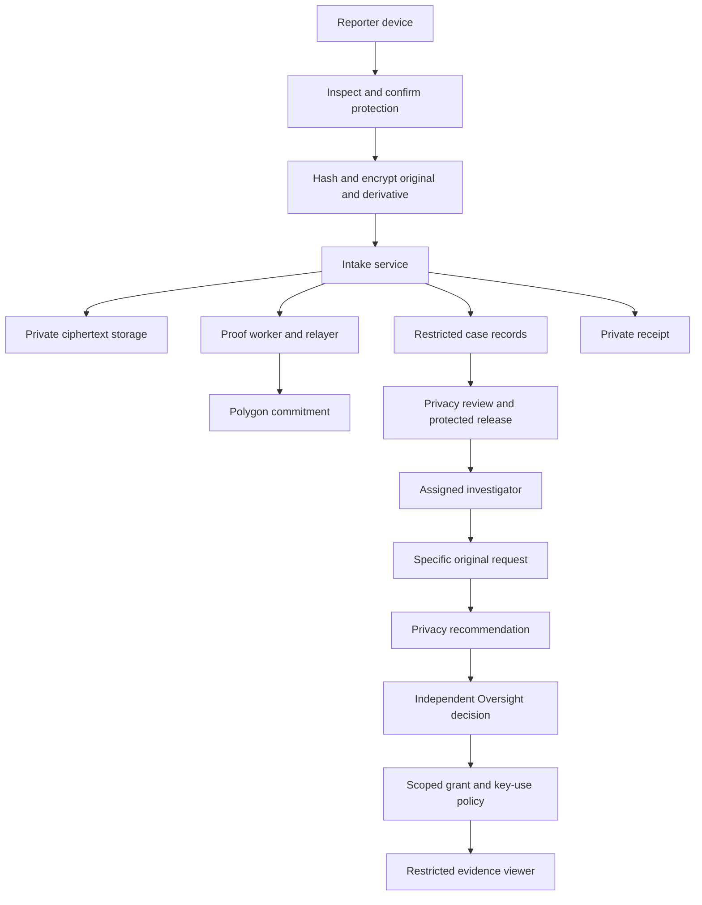

# VeilProof — Product Requirements Document

**Version:** 1.0 — draft for product and engineering review  
**Prepared:** 8 October 2026  
**Market:** India  
**Product:** Whistleblower reporting, evidence protection, integrity verification, and controlled investigation workspace  
**Release strategy:** Interactive demonstration → functional MVP using fictional evidence → controlled institutional pilot → production  
**Implementation status:** Requirements only. This document does not certify that any feature has been implemented or tested.

## 1. Executive summary

VeilProof enables people to report suspected corruption without creating a reporter identity profile. It helps them review potentially identifying information in evidence, prepares protected investigator copies, preserves encrypted originals, issues an independently verifiable integrity receipt, and provides private access to investigation updates.

The initial India-focused demonstration concerns government corruption, public procurement fraud, and retaliation. A reporter submits a fictional bridge-project complaint; a Privacy & Evidence Officer reviews protection and assigns an investigator; the investigator works from protected copies; exceptional access to an original requires Privacy review and independent Oversight approval.

The product combines three capabilities:

1. **Privacy Guardian:** evidence inspection and reporter-controlled protection of identity clues.
2. **Proof Receipt:** a private verification package backed by a salted blockchain commitment.
3. **Controlled Evidence Vault:** role-separated, purpose-specific, file-specific, time-limited access to originals.

**Product promise:** Help evidence reach an accountable investigation while minimizing exposure of its source.

**Preferred headline:** “Speak safely. Let the evidence be heard.”

The public interface must distinguish product capabilities from guarantees: account-free reporting does not establish complete anonymity; an integrity match does not prove an allegation true; a blockchain commitment does not guarantee continued file availability.

## 2. Document authority and working assumptions

This PRD consolidates seven Figma specifications, the supplied research memorandum, and the HackBios pitch deck. Later explicit workflow amendments take precedence over earlier prototype rules. Research informs security boundaries; the deck records the earlier pitch rather than overriding the latest product direction.

Requirements use **must** for release obligations and **should** for preferred behavior. Priorities are:

- **P0:** essential to the stated release, including its safety and correctness boundaries.
- **P1:** important enhancement after the P0 flow is complete.
- **P2:** roadmap or research item.

The following are **proposed defaults**, not previously confirmed project decisions:

| Decision | Draft default | Revisit before |
| --- | --- | --- |
| Initial deployment | One institution/operator; no cross-institution routing | Pilot |
| UI language | English first; externalized strings and Unicode input | MVP; pilot chooses additional languages |
| Original-access timer | Starts atomically on first authorized open; approval expires unused after 24 hours | MVP |
| Original-access duration | 15, 30, or 60 minutes; custom duration deferred | MVP |
| Staff session | 15-minute inactivity timeout; 8-hour absolute lifetime; recent authentication for approvals | Pilot security review |
| Critical-case acknowledgment | Target 15 minutes during explicitly staffed pilot coverage | Pilot operating agreement |
| Retention | No assumed universal duration; operator-approved schedule required | Any real-data pilot |
| Media scope | Broad fictional demo; real MVP processing limited to tested formats | MVP planning |

Decisions needing institutional or security approval appear in Section 23. These open items do not prevent building the fictional-data demonstration.

## 3. Problem, audience, and opportunity

Whistleblowers may possess useful records but avoid reporting because the submission process can expose them. Risks include account requirements, identifying file metadata, visible names/faces, recognizable voices, insider access, and retaliation. Separately, organizations may alter records, lose evidence, or deny a submission existed.

VeilProof addresses four distinct problems:

| Problem | Desired outcome | Boundary |
| --- | --- | --- |
| Identity exposure | Reduce unnecessary disclosure during intake and investigation | Network, device, and contextual identification remain separate risks |
| Evidence tampering | Detect differences from committed evidence versions | Does not establish whether the initial evidence was genuine |
| Unauthorized access | Restrict originals to independently reviewed grants | Must be enforced beyond UI controls |
| Denial/suppression of submission | Give reporters a verification record outside the case database | Cannot force investigation or prevent off-platform retaliation |

Primary reporter personas include public employees, contractors, vendors, citizens, and other people with evidence of suspected misconduct. The first scenario emphasizes a civil engineer facing retaliation. Institutional buyers/operators may later include authorized investigation bodies, organizational ethics teams, NGOs, universities, and media organizations. The initial real operator has not been selected.

Competitive positioning is the integrated workflow of local protection, reporter-held verification, and explicit access accountability. The PRD does not claim that anonymous reporting, encryption, or blockchain timestamping is individually novel.

## 4. Goals, non-goals, and success measures

### 4.1 Product goals

- Enable account-free complaint submission and private progress tracking.
- Make identity protection a visible, understandable decision before submission.
- Preserve originals independently from protected derivatives.
- Make protected copies sufficient for routine review wherever possible.
- Require independent, auditable authorization for exceptional original access.
- Give reporters a useful integrity-verification package without requiring a wallet.
- Surface retaliation and public-safety risks without delaying protective review for original-access approval.
- Provide an accessible mobile and web experience that remains calm under stress.

### 4.2 Non-goals

- Guaranteed anonymity, immunity, physical protection, legal admissibility, or investigation outcome.
- Automatic findings of corruption, guilt, authenticity, or reporter credibility.
- A public allegation feed, public evidence repository, cryptocurrency token, or reporter wallet.
- Automatic submission to CVC, CBI, police, Lokayuktas, or any real authority without an authorized integration.
- Unrestricted original downloads, bulk vault access, or public staff registration.
- Real-time messaging, anonymous follow-up uploads, and reporter-secret recovery in the first MVP.
- Automated recognition of which detected person is the reporter.
- Full protection of arbitrary PDF, audio, and video content in a short hackathon build.

### 4.3 Proposed success measures

Targets below are acceptance or pilot targets, not measured results.

| Measure | Target | Measurement |
| --- | --- | --- |
| Guided task completion | At least 8 of 10 consenting test participants complete a fictional report without facilitator intervention | Moderated usability study |
| Protection comprehension | At least 8 of 10 distinguish protected copy from sealed original and integrity from truth | Post-task questions |
| Duplicate submission | Exactly one accepted complaint across repeated taps/retries for the same operation | Automated integration tests |
| Original preservation | 100% byte/hash equality in supported-format test corpus | Decrypt-and-compare tests |
| Authorization boundaries | All enumerated denial cases pass | Server/API adversarial tests |
| Verification | Matching vectors pass; altered committed bytes fail | Independent verifier tests |
| Reporter confidentiality | No internal notes, staff identities, or identity-selection mappings in reporter responses | Contract and UI tests |
| Secret hygiene | No tracking secrets, keys, or report bodies in URLs/logs | Structured log and network inspection |
| Staff responsiveness | New events visible within 5 seconds under agreed test load | End-to-end tests |

Collect usability metrics with fictional cases. Production measurement must favor coarse operational aggregates over third-party reporter analytics, session replay, or device fingerprinting.

## 5. Release scope

| Capability | D0: interactive demo | M1: functional MVP | P1: controlled pilot / later |
| --- | --- | --- | --- |
| Reporter and four-role workflow | P0, shared in-memory state | P0, durable backend and authenticated staff | Operational procedures |
| Five evidence categories | P0, fictional fixtures | Only supported and independently validated processing paths enabled | Expand after format-specific testing |
| Identity scan/transform | Labelled fixture simulation | Real JPEG EXIF inspection and protected re-encoding; no claim of complete visible-content protection | PDF/text/image regions/audio/video protection |
| Original/copy separation | Distinct demo records | Separate encrypted versions and version-scoped authorization | Hardened isolated processing |
| Cryptography/upload | Labelled simulation | Real local hashing, authenticated encryption, ciphertext upload | Audited native/browser support |
| Blockchain receipt | Labelled fixtures | Real Polygon Amoy anchoring and independent verification with fictional data | Network decision, batching, operational support |
| Access approval | Working simulated transitions | Server-enforced Privacy + Oversight workflow | KMS/HSM policy integration and stronger trust separation |
| Countdown/revocation | P0 demonstration | Server-authoritative grant enforcement | Operational monitoring |
| Anonymous network route | Outside demo | Not claimed | Vetted route and threat-model review |
| Government integration | Fictional authority only | None | Contracted, jurisdiction-specific integration |
| Multilingual UI | English | Translation-ready | Languages chosen with pilot users |

**D0 is a demonstration of behavior, not security. M1 proves selected technical mechanisms using fictional evidence. Real high-risk submissions are out of scope until the pilot readiness gates are met.**

M1 must not accept unsupported real media into a flow that claims protection. Unsupported types may remain available only in a visibly separate fixture demonstration. A written complaint remains possible without evidence.

## 6. Personas and role permissions

### 6.1 Personas

- **Reporter:** needs a simple submission process, control over identifying clues, a private receipt, and trustworthy progress updates without registration.
- **Privacy & Evidence Officer:** needs to review safe protection summaries, release appropriate derivatives, assign an eligible investigator, and assess original-access scope.
- **Anti-Corruption Officer:** needs assigned complaints, released evidence, internal findings, safe reporter updates, and justified exceptional access.
- **Oversight & Whistleblower Protection Officer:** needs critical-risk queues, independent access review, audit visibility, and escalation/closure decisions.
- **Technical operator:** maintains availability and configuration. This is an operational role, not a default entitlement to evidence plaintext.

### 6.2 Permission matrix

| Action | Reporter | Privacy | Investigator | Oversight |
| --- | --- | --- | --- | --- |
| Create complaint | Yes, no account | No | No | No |
| View reporter tracking | Own credentialed status | No | No | No |
| Read tracking secret | At issue/import only | No | No | No |
| Review protected copies | Own pre-submit preview | Authorized queue | Assigned + released only | Explicitly authorized case scope |
| See reporter-to-clue mapping | Own local session | No by default | Never | No by default |
| Release protected copies | No | Yes | No | No routine release |
| Assign/reassign investigator | No | Yes, eligibility checked | No self-assignment | Review/escalate conflicts |
| Add internal findings/notes | No | Privacy notes only | Assigned cases | Oversight notes only |
| Publish safe progress update | No | System milestone only | Assigned cases | Approved escalation/closure update |
| Request original | No | No routine request | Assigned cases | No self-approved request |
| Recommend original access | No | Yes | No | No |
| Final original-access decision | No | No | No | Yes |
| Open original | No tracking preview | No by role alone | Only within active grant | No by approval role alone |
| Revoke active access | No | Yes | End own grant | Yes |
| Approve closure/reopen | No | No | Recommend only | Yes |
| View audit | Safe timeline only | Scoped privacy/access events | Scoped case summary | Full authorized case audit |

**P0 authorization rules:** enforce tenant, case assignment, role, file/version, request purpose, grant state, and time on the server. Privacy and Oversight decisions must come from distinct human principals; switching roles on the same account cannot satisfy independence. Requesters cannot approve their requests. Role changes and reassignment invalidate affected access.

Demo role switching is a labelled presentation shortcut and must never ship as production authentication.

## 7. Reporter requirements

### 7.1 Entry and safety — REP-01, P0

Home offers “Submit a protected report,” “Track my report,” and “Verify evidence receipt.” Staff sign-in is separate. Explain that no reporter account, phone, email, Aadhaar, or wallet is required. Show the receiving organization and demo status accurately.

Safety guidance is concise and actionable: trusted device/connection, unnecessary identifying details, keeping credentials private, and the limits of content protection. Do not imply the platform is an emergency-response service. An immediate-danger resource panel may be configured only with verified operator-specific information.

### 7.2 Complaint details — REP-02, P0

| Field | Requirement |
| --- | --- |
| Title | Required; 10–120 characters |
| Category | Required; predefined list plus Other |
| Description | Required; 50–5,000 characters |
| Department/project | Optional text; proposed maximum 200 characters |
| Incident | Optional past date or approximate period; exact future dates rejected |
| Location | Optional; user-entered, never automatic device location |
| People/organizations involved | Optional; no reporter-profile field |

Categories: bribery/kickbacks; public procurement fraud; misuse of public funds; falsification of records; abuse of authority; public-safety corruption; retaliation/threats; other.

Validate on blur and Continue, focus the first error, retain valid entries, and preserve input on Back. Unicode text must work even before the UI is translated. Provide a fictional-example action only in demo mode.

### 7.3 Risk assessment — REP-03, P0

Allow multiple selections: workplace retaliation; job loss/forced transfer; physical threat; family threat; immediate public-safety danger. “No immediate risk” is exclusive of the threat options.

Physical threat, family threat, or immediate public-safety danger sets **Critical** priority and opens an Oversight protection task on acceptance. Record the selected reasons rather than a mysterious numerical risk score. Queue escalation must happen independently of proof confirmation and original-access approval.

An officer may revise priority with a reason and an audit event. Downgrading a Critical case requires Oversight approval. Acknowledgment means staff received the task, not that protective action occurred.

### 7.4 Evidence intake — EVD-01, P0

For D0 use five cards, each with capacity one:

| Category | Allowed type | Proposed size ceiling when enabled |
| --- | --- | --- |
| Document | PDF | 15 MB |
| Image | PNG, JPG, JPEG as one category | 10 MB |
| Audio | MP3 | 25 MB |
| Video | MP4 | 100 MB |
| Reference | HTTPS URL | Proposed URL length 2,048 characters |

These ceilings are inherited/proposed prototype limits, not a promise of real processing support. M1 upload ceilings must be validated on its lowest-supported device before enabling a format.

Each card shows type, size, status, Preview, Replace, and Remove. Disable Add after capacity is reached. Replacement invalidates the replaced item's protection result and preview; unrelated items retain their state. Do not remove an existing item until replacement selection succeeds. Reports with zero evidence can continue and must never claim files were protected or verified.

Validate extension, declared MIME, actual signature, size, and decoding capability. Reject unsupported content and distinguish quarantine, processing failure, and selection cancellation. Treat malformed files as untrusted input; isolate parsers where supported.

Original filenames may be displayed locally during selection, but remote object names must be random. Use safe evidence labels after submission; identifying filenames must not become routine staff metadata. Never send sensitive files to public scanning services.

### 7.5 Reference links — EVD-02, P0

Collect HTTPS URL, title, and optional explanation/date accessed. Reject embedded credentials and unsafe schemes. Remove supported tracking parameters with a preview; do not silently remove parameters required to identify the resource. No automatic fetching, embedded preview, or background request to the submitted domain.

A link commitment covers the submitted reference record, not the future contents of a changing website. Any later webpage snapshot is a separate evidence version with acquisition details and authorized retrieval controls. Fictional .example links remain visibly non-functional.

## 8. Privacy Guardian requirements

### 8.1 Dedicated protection screen — PRV-01, P0

The screen at `/report/identity-protection` must be a full wizard step. Group findings by evidence item and then by names/text, faces/visual identifiers, speakers/audio, and metadata.

The system must say “potential identity clue,” not “reporter detected.” Reporters can select individual findings, protect all detected identities, preview the protected copy, and revise selections. For the high-risk demo, protecting all identities is the recommended option; the demonstration may preload the specified fictional selections.

Hidden metadata controls are automatically selected for supported transformations. A selected control is not evidence that removal succeeded: transformation and verification must complete before the status becomes Protected.

### 8.2 Identity-selection confidentiality — PRV-02, P0

“This is me” relationships must remain in the reporter's local session by default and be discarded when the session is cleared. Do not transmit this relationship to routine staff APIs, logs, audit events, or analytics. Processing instructions sent to an authorized component identify regions/findings to protect without labelling them as the reporter.

Staff may see safe transformation summaries, such as “one face protected,” without the pre-redaction name or reporter relationship. Raw scan findings containing sensitive text require restricted handling, not automatic inclusion in a general case record.

### 8.3 Version separation — PRV-03, P0

- Preserve original bytes exactly, compute their hash locally, and encrypt them without sanitizing them first.
- Generate a distinct protected derivative with its own hash, ciphertext, version identifier, and transformation manifest.
- Record tool/version, operation types, completion result, and verification status without exposing removed values in routine audit logs.
- Retain no remote plaintext copy as an implementation shortcut.
- Do not overwrite a committed derivative. A correction creates a new immutable version and superseding commitment.

Protected release must reference the exact reviewed version. A new version requires a new release decision. Grants for one original version cannot silently apply to another.

### 8.4 Failure behavior — PRV-04, P0

States: Not scanned → Scanning → Findings ready → Protecting → Protected; alternatively Unsupported, Failed, or Needs review.

If transformation fails, allow retry, replacement, removal, or submission without the attachment. Never substitute an unprotected original as the investigator copy. In D0, unsupported-file acknowledgment can demonstrate the flow; it must not bypass protection requirements for real evidence in M1/pilot.

Manual text/region/time-range selection is P1 after appropriate rendering and media-processing support. Voice masking and face blurring remain labelled demonstrations until implemented and independently evaluated.

## 9. Submission, receipts, and tracking

### 9.1 Submission — SUB-01, P0

Review shows complaint details, risk, destination, evidence inventory, and protection status with Edit links. D0/M1 require acknowledgment that only fictional information is being used.

Submission stages must correspond to actual operations or be explicitly labelled simulated. Acceptance requires durable complaint storage and complete, validated references to its successfully uploaded ciphertext objects; a failed upload cannot appear as accepted evidence.

Use an idempotency key for the complete submission operation. Repeated taps, network retries, and delayed responses must not create duplicate complaints. Persist accepted state before requesting blockchain anchoring. A delayed/failed chain operation changes proof status, not complaint acceptance. Use an outbox or equivalent reliable work queue for anchoring and notifications.

Recovery rules:

- Before acceptance: allow retry using the same operation ID; clean abandoned uploads through a documented lifecycle.
- After acceptance: recover the existing receipt rather than resubmitting.
- Before acceptance, prepare the tracking credential locally and preserve it in the active session; the backend stores only its verifier.
- If the response is lost, the existing credential and operation context recover the result within a bounded window. Do not put either into URLs.
- If the reporter loses both session and saved credentials, do not invent email recovery or a support bypass.

### 9.2 Tracking credential — RCP-01, P0

Issue a human-readable complaint reference and a separate cryptographically random tracking secret with at least 128 bits of entropy. The reference is an identifier, not authorization. Store a secure verifier of the secret, never a retrievable plaintext secret.

The credential grants only reporter-safe status access. It cannot unlock evidence or expose investigation records. Rate-limit verification with privacy-minimizing controls and generic failure responses that do not disclose case existence. Secrets never appear in URLs, browser history, analytics, logs, or staff views.

### 9.3 Receipt packages — RCP-02, P0

Provide two clearly differentiated artifacts:

1. **Private tracking receipt:** complaint reference, tracking secret, acceptance time, evidence count, and concise instructions. Label as private; copying is explicit.
2. **Integrity verification package:** versioned proof data needed to reproduce/check commitments. Contains no tracking secret, complaint description, identifying filename, or reporter identity. Explain that proof material can still be sensitive and is not intended for automatic publication.

A complete private backup may include both with separate sections. Download must produce valid versioned JSON. Native clients provide an explicit save/share action with a privacy explanation; do not claim a successful save before the platform reports it. Confirm before clearing an unsaved receipt.

### 9.4 Reporter tracking — TRK-01, P0

Require reference + secret, or an explicit receipt import. A current receipt session may navigate directly. Show latest status, last update, safe timeline, protection state, and proof state. Refresh displays either an update or “You are viewing the latest update.”

Exclude staff names, original-access requests, exact access times, internal notes, evidence previews, and confidential actions. Enforce this through a dedicated server response model, not client-side hiding.

Public milestones: Received → Privacy review completed → Assigned for investigation → Investigation in progress → Action initiated → Case resolved. Use “Closed” with a safe explanation where closure does not mean the allegation was substantiated. Expose “Additional review required” only with reporter-appropriate language.

No unauthenticated external notifications to reporters in M1. They check privately using their credentials.

## 10. Staff workflows

### 10.1 Privacy queue and release — STF-01, P0

Accepted complaints appear in the Privacy queue immediately, sorted by priority then age. Show safe summary, protection status, proof status, evidence inventory, and sealed-original indicators. Proof Pending must not block privacy review.

Actions: review protected preview; hold with reason; request protection correction; reject an unsupported item; release reviewed protected versions; assign an eligible investigator. Release is explicit and audited. A role change or page refresh must not duplicate it.

For M1, “protection correction” means an internal controlled task against supported processing. Reporter clarification/re-upload is not assumed available. If correction would require the reporter, hold with a truthful reason or proceed without that evidence according to policy; do not imply an unanswered message was sent.

### 10.2 Assignment — STF-02, P0

D0 lists ten fictional Anti-Corruption Officers with ID, expertise, jurisdiction, active workload, availability, conflict result, and eligibility. Sort by recommended, workload, expertise, or availability. Recommendations must expose their basis; no opaque AI matching is required.

Seed ACO-04 as recommended for procurement, ACO-07 available for financial fraud, and ACO-09 ineligible due to conflict. Validate eligibility again when assignment is committed. Conflicts and unavailability cannot be bypassed by manipulating the client.

Assignment creates an audit event and in-app notification. Reassignment preserves history, revokes the former investigator's grants, and ends old access sessions. No eligible officer produces a visible escalation state, not a silent default assignment.

### 10.3 Investigation — STF-03, P0

Assigned case sections: Overview; Allegations; Protected Evidence; Findings; Status & Updates; Internal Notes; Original Access; Audit Summary.

Investigators may review released versions, add append-only notes or tracked amendments, record preliminary findings, change permitted investigation status, publish a reporter-safe update, and recommend escalation/closure. Use allegation language; never automatically declare guilt.

Public updates and internal notes are separate fields and endpoints or explicitly separated command properties. Public updates require a preview/confirmation; never auto-publish internal notes. Published updates may be corrected through an auditable replacement, not an invisible historical rewrite.

### 10.4 Oversight and protection — STF-04, P0

Maintain separate queues for critical threats, original-access decisions, escalation, and closure. A Critical report creates a protection task even if evidence is absent or proof is pending. Record acknowledgment, owner, action state, and safe outcome; do not equate viewing a queue with providing protection.

Only Oversight approves final closure or reopening. Closure must include a reason, reporter-safe outcome, and disposition of active grants. Closing a case revokes active original grants and blocks new ones until reopened. Reopening requires a reason and does not restore expired grants.

## 11. Original-evidence access

### 11.1 Request — ACC-01, P0

An assigned investigator selects exactly one sealed original version and provides:

- Investigation purpose and intended action.
- Why the protected copy is insufficient.
- Requested duration and mode.
- Urgency with supporting explanation.

Available modes must reflect actual capability. View-only and stream-only do not imply prevention of screenshots or capture. Forensic analysis requires a separately authorized isolated analysis capability; do not claim a stream alone supports every forensic method.

D0 request: `Bribe_Discussion_Recording.mp3`, possible manipulation verification, protected voice masking affects relevant audio characteristics, stream-only, 30 minutes. This demonstrates access governance; forensic conclusions are not part of demo acceptance.

### 11.2 Privacy review — ACC-02, P0

Require active case, exact file/version, relevant purpose, protected-copy insufficiency, conflict check, limited duration, and proposed identity-risk controls. Decisions: Recommend, Clarification required, or Reject. A recommendation is not a grant.

### 11.3 Oversight decision — ACC-03, P0

Show request, current risk, Privacy recommendation, conflict result, conditions, and full decision history. Require necessity, proportionality, file specificity, duration justification, and auditability checks.

Decisions: Approve, Approve with narrower conditions, Clarification required, or Reject. Broader scope or a changed file/purpose requires a new Privacy review. More restrictive duration/mode is allowed only if compatible with the Privacy-approved scope. Bind both decisions to an immutable request revision.

### 11.4 Grant activation and expiry — ACC-04, P0

Notify the requesting investigator on approval. Under the proposed default, first authorized Open atomically changes Approved to Active and sets server start/expiry time. A concurrent second open must reuse the same grant timer. Unused approval expires after 24 hours. The countdown is presentational; server time governs permission.

Every evidence retrieval/stream continuation checks the grant, actor, case, file/version, mode, expiry, and revocation. Avoid long-lived URLs or client-held reusable decryption keys that outlive the grant. On expiry, revocation, case closure, reassignment, or sign-out, close the viewer, stop new delivery, remove access capability, and record an event. Previously seen or captured content cannot be recalled.

Use short-lived scoped delivery and bounded stream segments; target termination of further delivery within five seconds of revocation in the tested MVP environment. No offline original access. If authoritative authorization cannot be checked, deny new access.

## 12. Independent state models

Do not put all workflow concepts into one status enum.

| Domain | States |
| --- | --- |
| Complaint acceptance | Draft, Submitting, Accepted, Failed before acceptance |
| Investigation | Submitted, Privacy review, Ready for assignment, Assigned, Under investigation, Additional review, Escalation recommended, Action initiated, Resolution prepared, Closed |
| Protection per version | Not scanned, Scanning, Findings ready, Protecting, Protected, Needs review, Unsupported, Failed |
| Protected release | Pending, Held, Released, Withdrawn |
| Proof per version | Not requested, Queued, Submitted, Confirmed, Failed, Reconfirmation required |
| Original request | Draft, Privacy pending, Clarification required, Privacy rejected, Oversight pending, Oversight rejected, Approved, Cancelled |
| Grant | Approved unused, Active, Ended, Expired, Revoked |
| Protection task | Open, Acknowledged, Action in progress, Resolved |

Reopening is an audited transition out of Closed to a permitted investigation state. Evidence access must never automatically mark an investigation complete. Proof failure must never downgrade Accepted to Failed. Clarification revisions invalidate any approval whose scope changes.

## 13. Proof and verification requirements

### 13.1 Commitment — INT-01, P0

Use SHA-256 and a documented, unambiguous versioned encoding. The conceptual source formula binds domain separator, random salt, original hash, protected hash, and nonce. Engineering must publish canonical byte encoding and test vectors before implementation; concatenating ambiguous text strings is unacceptable.

For each file version, bind independent original/protected hashes, a random high-entropy salt, an opaque nonce, and the proof version. Use at least 256-bit random salts/nonces as the proposed default. Chain data contains only the salted commitment and minimal opaque version/reference information. Never publish content, category, filename, location, tracking secret, keys, or raw file hashes.

Reference links commit a canonical reference record under a distinct domain. A text-only complaint may receive a private salted submission-record commitment under a distinct domain; the UI must not call that evidence-file verification. Each accepted complaint can therefore have proof status without inventing attachments.

### 13.2 Relayer and chain — INT-02, P0 for M1

The backend relayer funds Amoy transactions. Reporters never connect wallets. Store chain ID, allowlisted contract address, transaction hash, event locator, version, confirmation status, and confirmed block information. Confirmation policy is configured and documented; a submitted transaction is not already confirmed.

Retries attach to the same logical commitment. Duplicate on-chain events must not create new complaints or evidence versions. Handle insufficient gas, RPC failure, reverted transactions, and reorganization/reconfirmation. A blockchain failure must not expose ciphertext keys or block staff review of an accepted complaint.

### 13.3 Verification package — INT-03, P0

The versioned package includes commitment encoding/version, salt, nonce, both expected version hashes where applicable, opaque evidence/version reference, commitment value, network/contract, transaction/event reference, and verification instructions. These values are private proof material and must be deliberately exported, not included in public staff summaries.

When checking one candidate file, compute its hash, compare the corresponding package hash, reproduce the commitment using the companion expected hash, and verify the contract event on the specified network. If the companion file was not supplied, state that only the supplied candidate's bytes were checked. Validate the package and allowlisted contract/version before presenting success.

The verifier must be documented and runnable independently of the case database. A local calculation without chain access may say “Local package matches; anchor not checked,” never “Blockchain verified.” Verification uploads neither candidate file nor private package to public services.

Results: Match; Mismatch; Pending confirmation; Invalid package; Unsupported version/network; Unable to check anchor. Explain that a match establishes integrity against the commitment, not allegation truth, authorship, pre-submission authenticity, or legal admissibility.

## 14. Data model and service boundaries

### 14.1 Core entities

| Entity | Important fields / constraints |
| --- | --- |
| Complaint | Internal opaque ID, safe reference, operator ID, encrypted narrative, category/risk access policy, lifecycle state, timestamps |
| TrackingCredential | Complaint binding, secret verifier, issue/revocation metadata; never plaintext secret |
| EvidenceItem | Complaint binding, category, safe label, size/type, opaque object reference |
| EvidenceVersion | Immutable original/derivative IDs, restricted hashes, encrypted object refs, crypto envelope, transformation manifest, parent version |
| Finding/Selection | Ephemeral local reporter findings; persisted safe processing manifest only where necessary |
| ProtectedRelease | Exact version, reviewer, outcome, time, reason |
| Assignment | Case, investigator, eligibility/conflict result, history |
| AccessRequestRevision | File/version, requester, purpose, mode/duration, reason, immutable revision |
| ApprovalDecision | Principal, role, request revision, decision, conditions, time |
| AccessGrant | Request binding, actor, scope, activation/expiry, state, revocation |
| ProofRecord | Versioned commitment, chain event reference, status; no plaintext content |
| ReporterUpdate | Explicit safe text, public milestone, publication/correction history |
| InternalNote | Scoped role/case access; excluded from reporter model |
| ProtectionTask | Risk, assigned reviewer, acknowledgment/action state |
| AuditEvent | Actor/role, action, opaque scope, time, result, request correlation; no secrets/content |
| Notification | Staff recipient, safe event summary, read state; no evidence plaintext |

Encrypt sensitive complaint text and risk narratives, not just attachments. Indexable routing metadata must be minimized and access-controlled. Classifying an individual as a reporter must not be an incidental effect of a staff-facing schema.

### 14.2 Service responsibilities

- **Reporter client:** local selection, supported protection, hashing/encryption, credential generation, receipt handling.
- **Intake service:** validation, upload coordination, idempotent acceptance, safe tracking authentication.
- **Case service:** staff authorization, assignment, investigation transitions, public/internal updates.
- **Evidence service:** immutable ciphertext versions, protected releases, scoped delivery.
- **Access policy/key service:** approval validation and purpose/file/time-bound key use; isolated from routine case administration.
- **Proof worker:** relayer submission, confirmations, retries, proof record updates.
- **Audit/notification workers:** durable events, staff queue delivery, operational alerts.

Local-first encryption and server-side inspection must be reconciled explicitly. A server cannot malware-scan ciphertext as though it were plaintext. Any authorized decryption/inspection happens in a documented restricted processing boundary and is audited. Encrypted upload alone does not make content safe to render.

### 14.3 Representative API contracts

| Operation | Contract expectation |
| --- | --- |
| Create intake / upload intent | Opaque IDs, size/type constraints, bounded ciphertext upload capability |
| Finalize complaint | Idempotency key, exact completed evidence refs, secret verifier; accepted result independent of chain completion |
| Authenticate tracking | Reference + secret in protected request body; generic failures; short-lived safe session |
| Get reporter status | Explicit safe response allowlist |
| Release derivative | Authorized Privacy reviewer + immutable version; optimistic concurrency |
| Assign case | Server-side eligibility check and audit |
| Publish update / add note | Distinct visibility command; no ambiguous shared text field |
| Request / decide original access | Immutable revision and server validation of separation of duties |
| Activate / use / revoke grant | Server clock, atomic activation, file-specific capability |
| Retry proof | Existing commitment only; no duplicate complaint |

Sensitive material must not appear in route/query strings. All mutation commands require replay/concurrency handling and authorization. Persist an audit event atomically with sensitive state changes; fail closed for original-access operations if the event cannot be durably recorded.

## 15. Architecture and cryptographic boundaries

The planned stack remains React Native + Expo + TypeScript + Expo Router + Zustand; FastAPI; Supabase PostgreSQL/private Storage; Solidity/Hardhat; Polygon Amoy; backend relayer using Web3.py or Ethers.js.

Browser-generated prototype code is not automatically Expo-native. Verify native library support on each target; if supported cryptography or processing needs custom native modules, use an Expo development build rather than weakening controls to preserve Expo Go compatibility.

Use AES-256-GCM or a vetted equivalent approved in implementation review, secure randomness, unique nonces per key, and authenticated metadata binding object/version identity. Use separate per-version data-encryption keys; a grant for one file must not disclose a reusable case-wide key. Wrap keys under a separately controlled key service. Keys never enter source control, ordinary database logs, or proof packages.

M1 may demonstrate policy-enforced key use within one backend trust domain and must label that limitation. “Cryptographic dual control” requires separately reviewed key-custody/threshold enforcement; two database approval rows do not establish it.

## 16. Security, privacy, and operational requirements

| ID | Requirement | Release |
| --- | --- | --- |
| SEC-01 | TLS; no plaintext evidence in remote storage, logs, URLs, notifications, or third-party processing | M1 |
| SEC-02 | Deny by default; staff MFA for pilot; session and principal checks on every sensitive API | M1/pilot |
| SEC-03 | No reporter analytics, session replay, advertising trackers, or unnecessary permissions | All |
| SEC-04 | Separate production, test, and demo environments; fixture role switcher absent from production | M1 |
| SEC-05 | Disable sensitive caching; clear viewer state on logout; revoke object URLs; exclude reporter routes/data from offline caches | M1 |
| SEC-06 | Dependency/parser review, file validation, isolated rendering, and bounded resource use | M1 |
| SEC-07 | Minimized security logs with restricted access and approved retention; no universal “zero logs” promise | Pilot |
| SEC-08 | Encrypted backups and restoration test covering both ciphertext and wrapped-key recovery | Pilot |
| SEC-09 | Authorized deletion/retention/hold workflow and backup-expiry policy | Pilot |
| SEC-10 | Security incident response, on-call ownership, key compromise/revocation procedure | Pilot |
| SEC-11 | Privacy-aware rate limits and resource quotas; assess any CAPTCHA/provider before use | M1/pilot |
| SEC-12 | No hidden administrator route to plaintext; document privileged infrastructure limitations and emergency procedures | Pilot |

Audit is append-only for application users; unauthorized modification must be detectable through protected export/checkpoint mechanisms in the pilot. Do not call ordinary editable database rows immutable. Audit should contain no raw allegation text, removed names, tracking secrets, keys, or evidence plaintext.

Encryption, timed access, and download controls cannot prevent an authorized viewer from remembering or externally capturing displayed information. The product must not claim otherwise.

## 17. India-specific deployment requirements

VeilProof is an intake and evidence-control product; software role names do not grant statutory authority. The pilot must name its actual operator, permitted categories, jurisdiction, response responsibility, and escalation partners before accepting real complaints.

Official PIDPI guidance describes an identity-bearing complaint procedure. Therefore, VeilProof must not imply that its account-free intake automatically constitutes an accepted PIDPI filing. Any later identity-disclosure or authority-routing process requires a separate, explicit workflow and operator authorization. [Official DDA PIDPI guidance](https://dda.gov.in/vigilance/PIDPI_complaints)

Before pilot approval, counsel/operator review must map applicable data-protection commencement, processing purpose, retention, security logging, breach response, electronic-evidence procedure, and disclosure obligations to the actual institution and deployment date. MeitY reports notification of the DPDP Rules in November 2025; this document does not assume every provision has the same commencement date. [MeitY annual report](https://www.meity.gov.in/static/uploads/2026/04/46face7d48c8f6a97030f713ad5fdab4.pdf)

CERT-In publishes directions and explanatory FAQs relevant to covered entities' security practices and logging. Their applicability must be assessed before making logging promises. [CERT-In directions and FAQs](https://www.cert-in.org.in/Directions70B.jsp)

The pilot checklist must also address India-region hosting policy, support languages, accessible intake, notices, grievance handling, lawful requests, and the difference between internal investigation and official enforcement. These are launch decisions, not statements of achieved legal compliance.

## 18. Experience, information architecture, and accessibility

### 18.1 Design system

Use warm canvas `#FAF9F6`, white surfaces, primary text `#252622`, secondary text `#62635D`, ember `#B94725`, pale accent `#FBEDE7`, and borders `#E3E1DA`. Use Inter with regular/medium/semibold weights, restrained semantic status colors, and generous spacing.

No neon, dark hacker aesthetic, decorative blockchain imagery, fake certifications, fear-heavy copy, or ornamental analytics. State what happened and what action is available. Keep technical identifiers in expandable details.

### 18.2 Navigation and routes

| Area | Routes |
| --- | --- |
| Public | `/`, `/safety`, `/track`, `/track/status`, `/verify` |
| Submission | `/report/details`, `/report/risk`, `/report/evidence`, `/report/identity-protection`, `/report/review`, `/report/submitting`, `/report/receipt` |
| Staff | `/staff/sign-in`, `/staff/dashboard`, `/staff/cases`, `/staff/cases/:caseId` |
| Case sections | `.../evidence`, `.../access`, `.../updates`, `.../audit` |
| Queues/account | `/staff/privacy-queue`, `/staff/access-requests`, `/staff/protection-queue`, `/staff/account` |
| Demo/utility | `/demo`, `/not-found` |

Expo Router uses `[caseId]` for dynamic segments. Use shared public, wizard, and staff layouts. Invalid/deep links route to the earliest valid prerequisite or a clear denied/not-found state. Never infer a completed receipt after session loss. Validate internal sign-in return destinations.

Mobile public navigation: Home / Track / Verify; hide it within the wizard. Staff navigation adapts to role. Desktop uses a neutral staff sidebar. Preserve case filters and scroll position on return. Browser Back must not resubmit accepted reports.

### 18.3 Accessibility targets

Target WCAG 2.2 AA for the web experience, with manual keyboard/screen-reader checks in addition to automated checks. Text contrast at least 4.5:1 for normal text; meaningful UI boundaries and large text at least 3:1. Use persistent labels, visible focus, status/error announcements, focus-managed dialogs, reduced-motion support, and no color-only meaning.

Main touch actions are at least 48px. Verify layouts at 360, 390, 834, and 1440px. Tables become cards on mobile; long identifiers wrap/truncate with accessible expansion; keyboard and safe areas must not obscure the active field or action. Do not make essential tasks depend on hover or gestures alone.

## 19. Nonfunctional targets

All targets are proposed and require a documented benchmark environment.

| Area | Target |
| --- | --- |
| Baseline load | 100 concurrent staff sessions; 20 concurrent submission finalizations; media transfer tested separately |
| Routine API latency | p95 under 1 second for non-media reads/mutations under baseline load |
| Staff state propagation | Within 5 seconds of committed change |
| Revocation enforcement | Stop further protected delivery within 5 seconds; no fresh request succeeds after server expiry |
| Local processing | Progress/cancel feedback within 1 second; no claimed universal transform duration |
| Accessibility | No blocking keyboard/screen-reader defects in P0 journeys |
| Availability | Pilot target 99.5% monthly excluding agreed maintenance; not an emergency-service SLA |
| Recovery | Proposed pilot RPO ≤24 hours, RTO ≤8 hours; operator must approve suitability before real evidence |
| Observability | Operational error rates, proof backlog, queue age, grant failures; no sensitive-content telemetry |

Store canonical timestamps in UTC, display clearly in the user's configured time zone, and default the Indian demo to IST. Grant calculations always use server UTC. Network loss must not silently mark an incomplete upload, processing operation, or approval successful.

## 20. Canonical demonstration and acceptance tests

### 20.1 Fixture

Case `VP-2026-1048`: **Suspected ₹18 Crore Public Bridge Construction Scam**. Fictional State Public Works Department; Riverfront District Bridge Rehabilitation Project. Allegations are unverified. Select physical/family threats and public-safety danger.

Evidence: `PWD_Payment_and_Inspection_Report.pdf`; `Steel_Grade_Site_Photo.jpg`; `Bribe_Discussion_Recording.mp3`; `Material_Removal_From_Site.mp4`; fictional state tender reference. Reporter selections: Rahul Sharma, Face 2, Speaker 1. These are fixture labels, not identities inferred from uploads.

Initial demo cases: road-contract billing irregularity; hospital equipment procurement concern; housing allocation manipulation. A new submission appears alongside them. The fixed reference is reserved for the canonical walkthrough; other submissions receive unique references.

### 20.2 End-to-end walkthrough

1. Start a fictional report and modify its title.
2. Select Critical risk conditions.
3. Add at most one item in each evidence category.
4. Inspect potential identity clues and change selections.
5. Preview protection and show separate sealed originals.
6. Submit once and receive tracking and verification artifacts.
7. Observe the case in Privacy and the protection task in Oversight.
8. Release reviewed copies and assign eligible ACO-04.
9. Investigator sees the exact edited case and only released copies.
10. Add distinct internal and reporter-safe updates.
11. Request one original audio version with reason/mode/duration.
12. Privacy recommends; original remains sealed.
13. Oversight independently approves; investigator receives notification.
14. First Open activates the 30-minute grant and countdown.
15. End/revoke/expire the grant; viewer closes and audit updates.
16. Reporter tracks with both credentials and sees only safe updates.
17. Verify matching and modified fixtures with distinct results.
18. Reset/refresh restores demo fixtures only; durable M1 refresh does not delete complaints.

For D0, a labelled simulated-clock advance can demonstrate expiry without waiting 30 minutes. Production must contain no clock-advance bypass.

### 20.3 Acceptance matrix

| Test | Expected result | Release |
| --- | --- | --- |
| AT-01: Report without attachments | Accepted; evidence count zero; no invented scan results | D0/M1 |
| AT-02: Second item in category | Rejected; original item retained | D0 |
| AT-03: Replace one file | Only its findings/preview reset | D0/M1 |
| AT-04: Unknown/failed protection | Cannot become Protected or auto-release | D0/M1 |
| AT-05: Repeated Submit/proof retry | One complaint; existing proof operation reused | D0/M1 |
| AT-06: Wrong reference/secret | Generic failure; no case disclosure | D0/M1 |
| AT-07: Reporter API inspection | No staff names/internal notes/access decisions | M1 |
| AT-08: Conflicted officer | UI and API refuse assignment | D0/M1 |
| AT-09: Same principal uses two roles | Cannot satisfy independent decisions | M1 |
| AT-10: Privacy recommendation only | Original denied | D0/M1 |
| AT-11: Grant for file A used for B | Denied, event recorded | M1 |
| AT-12: Request scope changed | Stale approvals cannot activate access | M1 |
| AT-13: Concurrent first opens | One start/expiry pair | M1 |
| AT-14: Expiry/revocation/background tab | Server rejects further access; UI closes when active | D0/M1 |
| AT-15: Reassignment/closure | Existing grants revoked; former officer denied | M1 |
| AT-16: Original round trip | Decrypted bytes equal original exactly | M1 |
| AT-17: Seeded JPEG metadata | Supported seeded fields absent in exported derivative | M1 |
| AT-18: Alter committed file/package | Mismatch/invalid result; never Match | M1 |
| AT-19: Wrong contract/network/version | Unsupported/invalid, not verified | M1 |
| AT-20: RPC/proof failure | Complaint retained; proof recoverable | M1 |
| AT-21: Lost acceptance response | Existing operation recovered with session credential | M1 |
| AT-22: Identity-selection mapping | Absent from staff payloads/audit | D0/M1 |
| AT-23: Malformed/MIME-mismatched file | Rejected or quarantined before protected release | M1 |
| AT-24: Critical report, proof pending | Protection task exists; no dependency on original access | D0/M1 |
| AT-25: Keyboard/screen reader/360px | P0 flow usable; no overflow/blocked actions | D0/M1 |
| AT-26: Staff direct API privilege bypass | Denied irrespective of frontend routing | M1 |
| AT-27: Secret/log/cache inspection | No forbidden content or credentials | M1 |

D0 demonstrates fixture behavior only. M1 test evidence must record environment, test data, expected/actual result, and limitations. No test may be marked passed from a UI screenshot alone where backend enforcement is required.

## 21. Delivery plan and release gates

### D0 — connected demonstration

Deliver reusable design system, all P0 routes, shared session store, four-role switcher, five-category fixture flow, identity-protection screen, protected/original separation, sequential approvals, countdown, reporter tracking, proof fixtures, and reset. Label every simulated security operation. Refresh resets only this demonstration.

### M1 — functional technical MVP

Deliver backend schemas/auth, server authorization, immutable encrypted evidence versions, supported local processing, per-file key-use boundaries, durable submission/idempotency, Amoy contract/relayer, downloadable packages and independent verifier, staff audit/notification workflow, and negative tests. Use fictional evidence and documented controlled environments.

### Pilot readiness gate

Before accepting real evidence: select operator/jurisdiction; approve threat model and key design; conduct independent security review and fix critical findings; validate supported transformations; establish retention/logging/backup policies; complete legal review; staff the protection workflow; test revocation and incident response; publish accurate capability limits and support coverage.

### Later releases

Format-specific multimedia protection; multilingual interfaces; secure reporter follow-up channel; network-private submission; batched commitments; stronger independent key custody; controlled legal export packages; authorized institutional integrations. Each adds its own acceptance criteria before inclusion.

Schedule and staffing are not committed in this PRD. The earlier “24-hour” statement is a hackathon scope hypothesis, not a delivery estimate for this entire document.

## 22. Risks and dependencies

| Risk/dependency | Impact | Mitigation / owner |
| --- | --- | --- |
| Unselected operator | No accountable destination or real protection process | Product lead + institutional sponsor select before pilot |
| Overbroad anonymity claims | Users may make unsafe assumptions | Product/security review of capability wording |
| Weak key custody | Approvals can be bypassed by privileged infrastructure | Security lead specifies key service and trust boundaries |
| Incomplete redaction | Identity clues survive in derivative | Format-specific corpus, previews, manual review, explicit support scope |
| Receipt exposes sensitive proof material | Sharing enables evidence correlation | Separate tracking/proof artifacts and clear sharing guidance |
| Public transaction timing | Submission correlation | Relayer now; evaluated batching/private route later |
| Encrypted malicious files | Dangerous processing/viewing | Restricted processing boundary, quarantine, parser isolation |
| Lost credentials | Reporter cannot retrieve updates | Explicit save workflow; no insecure recovery bypass |
| Chain/provider outage | Proof confirmation delayed | Accept independently, retry worker, degraded status |
| Storage/key loss | Evidence unavailable despite proof | Recovery-tested encrypted backups and key recovery |
| Critical queue unstaffed | False expectation of protective response | Published coverage, escalation agreement, queue monitoring |
| Demo mistaken for production | Real evidence enters simulated workflow | Separate environments, clear labels, no real intake until gates |

## 23. Decision register

| ID | Decision needed | Proposed owner | Blocks |
| --- | --- | --- | --- |
| DEC-01 | Actual operating institution and jurisdiction | Product lead / sponsor | Real pilot |
| DEC-02 | Key custody, wrapping, privileged access, recovery | Security + engineering | M1 architecture/pilot |
| DEC-03 | Supported M1 formats and exact transformation guarantees | Engineering + privacy lead | M1 upload enablement |
| DEC-04 | Approve first-open timer and unused-grant lifetime | Privacy + Oversight | M1 access policy |
| DEC-05 | Canonical commitment/receipt encoding and independent verifier | Engineering + security | Live proof integration |
| DEC-06 | Complaint-text encryption and routable metadata scope | Privacy + security | Durable intake |
| DEC-07 | Legal routing, retention, disclosure, log requirements | Operator + counsel | Real pilot |
| DEC-08 | Response coverage and protective-action partners | Operator + Oversight | Real pilot |
| DEC-09 | Pilot languages and accessibility testing participants | Product + operator | Pilot usability |
| DEC-10 | Forensic-analysis mode and permissible exports | Investigation + security | Real forensic feature |
| DEC-11 | Evidence version correction/withdrawal and legal hold policy | Privacy + counsel | Pilot operations |
| DEC-12 | Production proof network and anchoring policy | Product + engineering | Beyond testnet |

## 24. Source register and traceability

Project sources are requirements/rationale, not evidence of implementation:

- [Reconstructed project context](./VEILPROOF_PROJECT_CONTEXT.md): source precedence, latest workflow, unresolved decisions, and original attachment paths.
- [Research memorandum](C:/Users/ARSH/Downloads/VeilProof_Deep_Research_and_References.md): threat model, local-first security, salted receipts, MVP boundaries, and institutional adoption.
- [HackBios deck](C:/Users/ARSH/Downloads/JeeJeeBrats_HackBios_3.0.pdf): three-pillar pitch and initial architecture; later role/design changes supersede earlier diagrams.
- Figma prompts 1–2: submission, receipts, reactive shared demo, accessibility, and navigation.
- Figma prompts 3–4: distinct staff roles, sealed originals, independent reviews, India corruption/retaliation scenario.
- Figma prompt 5: consolidated product, routes, proposed stack, commitments, and verification limits.
- Figma prompts 6–7: dedicated identity selection, confidential selections, one item per category, assignment, sequential decisions, and timed original access.

External official sources consulted for the limited deployment context appear beside the relevant requirements in Section 17. The PRD does not reproduce market statistics or treat the research document's scores as validation.

**Definition of completion:** A release is complete only when its scoped requirements, denial paths, and acceptance tests pass with recorded evidence; simulated capabilities remain visibly identified; and all decisions blocking that release are resolved by their owners.
