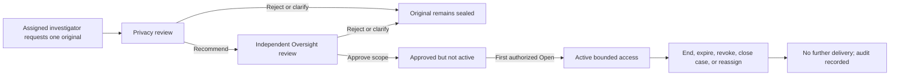

# VeilProof — Security and Access Document

**Version:** 1.0 — draft policy and control specification  
**Prepared:** 8 October 2026  
**Applies to:** Reporter intake, staff workflows, evidence processing, key use, proof verification, infrastructure operations, and support  
**Baselines:** [PRD v1.0](C:/Users/ARSH/.codex/.chatgpt-projects/g-p-6ac7d025dd78819197e1a0de2c25aeac/VeilProof_PRD_v1.0.md) and [Technical Architecture v1.0](C:/Users/ARSH/.codex/.chatgpt-projects/g-p-6ac7d025dd78819197e1a0de2c25aeac/VeilProof_Technical_Architecture_v1.0.md)  
**Status:** Proposed requirements, not proof of implementation, a security assessment, or a legal compliance certification.

## 1. Purpose and security position

This document defines who may access VeilProof resources, under what conditions, how permissions are enforced and withdrawn, and what evidence is required to demonstrate that controls work. It complements the PRD's product behavior and the architecture's implementation design.

VeilProof's security objective is to reduce exposure of whistleblowers while preserving useful evidence and accountable investigation. The product must minimize identity collection, preserve originals, release protected copies for routine review, and independently authorize exceptional original access.

The proposed system is encrypted before upload but is **not server-blind end-to-end encryption**: approved processing and viewing services may decrypt content within defined trust boundaries. The operator and its privileged infrastructure remain part of the threat model.

Security claims must match the deployed release. Account-free reporting does not guarantee anonymity; metadata removal does not remove every contextual clue; a blockchain match does not establish truth; a timer cannot recall information already displayed.

## 2. Applicability, policy language, and release profiles

**Must** indicates a requirement for the stated release. **Should** indicates a recommended control with a documented deviation if omitted. **Proposed default** is a design setting awaiting approval, not an already adopted organizational policy.

| Release | Permitted use | Security obligation |
| --- | --- | --- |
| D0 — interactive demonstration | Fictional fixtures only | Correct simulated permission behavior, confidentiality of demo selections, clear labels; no production-security claim |
| M1 — functional MVP | Fictional test evidence only | Actual backend authorization, tested supported cryptography, persistent audit, recovery, and limited evidence processing |
| P1 — controlled pilot | Real evidence only after explicit readiness approval | Named operator, approved threat model/key custody, MFA, independent assessment, retention/recovery policy, and staffed response |
| Later production | Approved institutional scope | Continuous control operation, periodic review, supported media guarantees, and deployment-specific obligations |

Unless a section says otherwise, software control requirements apply to M1 and later; organizational controls are mandatory before P1. D0 demonstrates corresponding behavior where relevant but does not satisfy server or cryptographic requirements.

Document approval does not itself authorize live data intake. Unresolved security decisions in Section 27 must be closed for the relevant release. No source files or earlier specifications are modified by this draft.

## 3. Security objectives and non-negotiable boundaries

| Objective | Required property |
| --- | --- |
| Reporter privacy | No compulsory reporter identity profile; no staff-visible “this is me” relationship |
| Evidence confidentiality | Ciphertext at rest; narrowly scoped authorized plaintext processing |
| Original preservation | Exact submitted bytes retained under separate encryption from derivatives |
| Access accountability | Every sensitive grant and delivery decision attributable and auditable |
| Independent review | Requester, Privacy reviewer, and Oversight reviewer are distinct human principals |
| Integrity verification | Versioned commitments and independent verification without revealing tracking access |
| Availability and recovery | Recoverable accepted records and keys according to approved recovery objectives |
| Safe progress communication | Reporter projection excludes confidential investigation details |

Non-negotiable boundaries:

1. Case reference alone grants no access.
2. A role name alone never authorizes original viewing.
3. One file's grant never unlocks another file or a later version.
4. A Privacy recommendation alone never releases an original to an investigator.
5. Requesters cannot approve their own access, including through a second account.
6. No original decryption key is sent to an investigator's browser or mobile client.
7. No hidden administrator or emergency bypass is part of M1.
8. Evidence, raw file hashes, identities, and secrets never go on-chain.
9. Expired, revoked, closed-case, or reassigned access is not restored by a refresh, reconnect, or backup recovery.
10. An unknown authorization state denies new sensitive access.

## 4. Data classification and handling

The following is a proposed internal classification scheme. “Protected” describes a derivative's processing state; it does **not** make the derivative public or non-sensitive.

| Class | Examples | Required handling |
| --- | --- | --- |
| C0 — Public | Product pages; published documentation; opaque chain commitments | Deliberate publication only; no internal IDs or context added to chain records |
| C1 — Internal operational | Safe uptime metrics; deployment inventory; non-sensitive configuration | Authorized operators; no external sharing by default |
| C2 — Confidential case | Safe case reference, assignment, investigation status, reporter-safe updates before authorized retrieval | Case/operator scope; authenticated retrieval or tracking credential |
| C3 — Restricted evidence | Originals, protected derivatives, allegation narrative, threat details, private proof inputs, raw findings | Encryption, least privilege, controlled processing, scoped audit |
| C4 — Security secrets | Tracking secret, intake capability, session tokens, DEKs, wrapping-key material, peppers, signer credentials | Secret-specific storage/use; never ordinary logs, URLs, tickets, or analytics |

Additional rules:

- Reporter-to-clue mappings are C3 with a **local-only restriction**; they are not ordinary staff records.
- Safe public updates remain private to the credentialed reporter and authorized staff; they are not a public case feed.
- Proof packages are C3 even without a tracking secret: they can confirm known evidence against a commitment.
- Operational data containing case IDs, rare categories, timestamps, or threat indicators may be C2/C3 through correlation.
- Derived files, thumbnails, transcripts, screenshots, caches, exports, backups, and parser outputs inherit the source classification unless an explicit reviewed transformation justifies otherwise.
- Staff must not copy case content into consumer AI tools, personal cloud drives, public malware scanners, or unapproved support systems.

## 5. Threat model and residual risk

| Threat | Attack or failure | Primary controls | Residual limitation |
| --- | --- | --- | --- |
| External attacker | Enumerates references or steals sessions | Random credentials, generic failures, session protection, rate limits | Stolen valid credentials may be usable until revoked |
| Malicious investigator | Opens originals or unrelated cases | Assignment checks, independent decisions, file/version grants | Authorized viewing can still be recorded externally |
| Colluding reviewers | Approve improper access together | Distinct principals, conflict checks, audit review, role governance | Software cannot ensure honest judgment or eliminate collusion |
| Privileged operator | Bypasses DB policy or changes code/key policy | Separate service identities, deployment review, custody controls, external audit checkpoints | Single-operator M1 does not resist full operator compromise |
| Compromised reporter device | Captures evidence before encryption | Minimal local persistence and practical safety guidance | Platform cannot make a compromised endpoint trustworthy |
| Modified client build | Exfiltrates local plaintext/keys | Controlled releases, dependency review, CSP, build provenance | Hosted client delivery remains trusted infrastructure |
| Metadata/content leak | Names, faces, device clues, voices survive | Supported transformations, reporter preview, privacy release | Unknown or contextual clues can remain |
| Malicious upload | Parser exploit, decompression bomb, active content | Allowlist, isolated inspection, quotas, safe rendering | Scanning cannot guarantee harmless content |
| Network/provider observer | Correlates IP, timing, file size, proof time | No trackers, minimal logs, relayer, future private-route/batching review | Ordinary web/mobile transport is not guaranteed anonymous |
| Evidence replacement/deletion | Changes or removes stored records | Immutable versions, ciphertext authentication, commitments, backups | Commitments do not restore deleted evidence |
| Workflow race/replay | Reuses approvals or changes scope after review | Revision binding, idempotency, row locks, expiry checks | Implementation must be tested under concurrency |
| Resource exhaustion | Floods intake, storage, processors, or relayer | Privacy-aware quotas, bounded jobs, budgets, backpressure | Anti-abuse controls can themselves create privacy leakage |
| Coercion/retaliation | Forces credential disclosure or harms source | Restricted information and operator protection workflow | Software cannot ensure physical protection |

The threat model must be reviewed after changes to media support, key custody, operator, external integrations, or client distribution. Risk acceptance requires a named accountable owner; a diagram or checklist alone does not establish protection.

## 6. Security ownership and governance

| Function | Responsibilities | Cannot grant by itself |
| --- | --- | --- |
| Product owner | Scope, capability wording, release definition | Security certification or access outside policy |
| Privacy lead / Privacy Officer | Protection policy, derivative release, original-request privacy review | Final original-view access |
| Investigation lead | Staff assignment standards, investigative purpose, safe updates | Own original request or case closure |
| Oversight lead | Independent access decisions, threat escalation, closure governance | Unreviewed self-access to originals |
| Security lead | Threat model, key/service policies, tests, incident handling | Routine investigative access |
| Platform operator | Availability, deployment, backups, infrastructure maintenance | Business entitlement to plaintext |
| Identity administrator | Staff enrollment and role lifecycle | Self-authorized elevation or original approval |
| Operator/counsel | Jurisdiction, retention, disclosure, reporting obligations | Technical proof that controls work |

In a small team one person may perform multiple development functions, but a person cannot satisfy multiple required decision stages on the same case. Any environment unable to enforce this remains a fictional-data test environment.

Proposed review cadence for pilot: monthly privileged-role/grant review, quarterly full access recertification, and an immediate review after personnel changes or suspected compromise. These are internal targets awaiting operator adoption, not statutory deadlines.

## 7. Human identity and staff account lifecycle

### 7.1 Enrollment

Staff accounts are invite-only. The operator verifies staff identity and links all accounts/memberships of the same person to one `human_principal_id`. Do not collect reporter identity to implement staff identity governance.

Role assignment requires an authorized sponsor, documented need, operator scope, and independent provisioning review for privileged roles. No shared accounts, generic “investigator” credentials, or self-service role elevation. Authentication-provider subject identifies the account; business permissions come from the server-managed membership record.

### 7.2 Authentication

Pilot staff access requires MFA. Prefer phishing-resistant authenticators where the selected identity provider supports them; document any fallback and its recovery controls. M1 must implement real identity validation and test MFA/session integration before claiming pilot readiness.

Validate token signature, issuer, audience, expiry, allowed algorithm, current membership, and server session state. Never accept client-submitted roles or treat successful login as authorization to all cases.

### 7.3 Transfer, suspension, and departure

- Role/operator changes revoke or re-evaluate sessions, assigned-case permissions, active grants, and pending decisions.
- Suspension blocks access immediately at the server; deleting a browser token is insufficient.
- Reassignment revokes the previous investigator's grants and opens no equivalent grant for the replacement.
- Offboarding removes membership, authenticators/recovery access, service access, and privileged infrastructure access as applicable.
- Preserve historical attribution to the original principal; do not rewrite audit history when an account is disabled.

### 7.4 Account and MFA recovery

Recovery uses operator-approved verification and an independent administrator. Revoke existing sessions/viewer handles and require reauthentication after recovery. Recovery must not grant additional roles or bypass pending approvals. Suspected compromise invalidates affected unactivated approvals and active grants pending review. Notify through an approved staff channel without case details.

Reporter credential recovery is a different policy: M1 provides no support, email, or staff bypass for a lost tracking secret.

## 8. Role-based permissions and case scope

Permission cells below assume an active authorized session, operator match, and current case scope. **No** is a default denial; **Scoped** requires the stated policy. Technical operators are included to make their lack of business entitlement explicit.

| Resource/action | Reporter | Privacy | Investigator | Oversight | Technical operator |
| --- | --- | --- | --- | --- | --- |
| Submit complaint | Own intake | No | No | No | No |
| View reporter-safe status | Own valid credential | Scoped staff view | Assigned case | Scoped case | No default |
| Read tracking secret | Local issue/import only | No | No | No | No |
| See “this is me” mapping | Own local session | No | No | No | No |
| Read complaint narrative | Own draft before submit; no later evidence view | Scoped triage | Assigned case | Scoped risk/review | No default |
| Preview unreleased protected copy | Own pre-submit preview | Assigned privacy queue | No | Only explicit review scope | No |
| Release protected copy | No | Reviewed version | No | No routine release | No |
| View released derivative | No tracking evidence preview | Scoped | Assigned + released | Explicit case review | No |
| Assign/reassign investigator | No | Eligible officer only | No self-assignment | Escalate conflict, not silent assignment override | No |
| Add internal notes | No | Privacy notes | Assigned investigation | Oversight notes | No |
| Publish reporter update | No | Approved system milestone | Assigned case, explicit publication | Approved escalation/closure | No |
| Request original | No | No routine request | Assigned investigator | No routine request | No |
| Recommend original access | No | Independent reviewer | No | No | No |
| Approve original access | No | No | No | Independent reviewer | No |
| Open original | No | No by role | Active exact-version grant | No by role | No |
| End own grant | No | Not applicable | Yes | Not applicable | No |
| Revoke original grant | No | Scoped | End own only | Scoped | Emergency technical containment only |
| Approve closure/reopen | No | No | Recommend only | Yes | No |
| Read audit | Safe public timeline | Scoped privacy/access | Assigned summary | Full authorized case | Operational subset only |
| Manage infrastructure | No | No | No | No business authority | Approved privileged task |

“Emergency technical containment” means disabling delivery or credentials, not opening evidence or granting access. An administrator can shut down a compromised service without acquiring the right to examine its cases.

Protected copies are not automatically visible to every staff member. Privacy and Oversight access need queue/case responsibility; broad organizational roles are insufficient for indiscriminate browsing.

## 9. Authorization decision model

Use role permissions together with resource attributes and relationships. Every read, write, export, stream continuation, background task, and internal key-use request must have a defined authorizer.

Minimum decision inputs:

- Principal and human-principal identity; active membership and session assurance.
- Operator boundary and requested action.
- Case responsibility/assignment; active conflict restrictions.
- Exact resource and immutable version.
- Case state, protection/release state, and current policy revision.
- Request revision, independent decisions, approved purpose/mode/duration.
- Grant state, activation/expiry, revocation epoch, and authoritative time.

```text
ALLOW only if every applicable predicate is true.
Missing attribute, stale scope, unknown role, policy error, or unavailable
authoritative state => DENY new sensitive access.
```

Authorization occurs in the API and evidence/key boundaries, not solely in navigation or UI components. Opaque IDs reduce accidental disclosure but do not replace checks. Bulk/list/search endpoints require the same isolation as detail endpoints. Filter unauthorized rows before counting/paginating so totals do not disclose unrelated cases.

Policy principles align with least privilege, default denial, and request-level checks described in [OWASP Authorization guidance](https://cheatsheetseries.owasp.org/cheatsheets/Authorization_Cheat_Sheet.html). VeilProof's matrices and thresholds are project-specific requirements, not claims of OWASP certification.

## 10. Separation of duties and conflicts of interest

### 10.1 Required independence

Original human access requires three distinct people: requesting investigator, Privacy reviewer, and Oversight reviewer. Alternate accounts, delegated sessions, role switching, or temporary membership changes cannot satisfy independence.

Privacy release and investigator assignment are distinct commands with recorded responsibility. Investigation findings and case closure are distinct responsibilities. Technical key administration must not allow its administrator to manufacture business approvals through a routine interface.

### 10.2 Conflict handling

Conflict checks apply at assignment, request, review, approval, and activation. Record the result and relevant policy basis without broadly exposing sensitive conflict details. A detected conflict makes the officer/reviewer ineligible for the affected decision.

If a conflict is discovered later, suspend the affected entitlement, revoke active grants, and have an independent reviewer assess prior actions. No eligible reviewer means the request waits/escalates; it does not reduce the number of required independent people.

An officer who participates in the investigation cannot later approve their own original request by becoming Oversight. Historical human-principal participation remains relevant after a role change.

### 10.3 Reviewer departure versus compromise

Proposed conservative rule: before activation, loss of a required reviewer's membership or newly discovered conflict invalidates the pending approval and requires a new review. During active access, a compromise/conflict signal immediately revokes the grant. Ordinary staff departure during an active grant should also revoke under the initial pilot policy; any less restrictive approach requires a documented policy decision.

## 11. Reporter privacy, credentials, and support access

### 11.1 Intake

Collect complaint/risk details needed for the report, not a reporter identity profile. Avoid automatic location, advertising identifiers, contact-book access, push tokens, and unnecessary device permissions. No third-party reporter analytics, session replay, or marketing trackers.

Keep draft plaintext, selected identity relationships, local preview buffers, and raw keys ephemeral. Never send “Rahul Sharma is the reporter” or equivalent mappings in case records, scans, telemetry, or audit. Staff summaries may state that a name/face was protected without the identity relationship.

No application can guarantee that the operating system, browser, compromised device, or user's explicit downloads leave no traces. UI wording must describe actual clearing behavior rather than claiming universal erasure.

### 11.2 Tracking secret

The architecture proposes a 32-byte random secret, a separate reference, and a server-keyed verifier. The secret is generated locally, transmitted transiently only to protected registration/login endpoints, and never persisted in plaintext by the service. Pepper material is outside the database and versioned separately.

This follows architecture ADR-08 and refines the PRD's ambiguous client-verifier wording. Do not turn a stored verifier into a reusable bearer credential. Final adoption requires the corresponding design decision.

Only safe tracking/proof-package access is authorized by the tracking credential; it cannot unlock evidence or staff records. Failure responses must not distinguish a missing case from an incorrect secret. Rate limits must not create a reliable case-existence oracle or a trivial permanent lockout of a known victim reference.

### 11.3 Receipt handling and support

- Copy/download only on explicit action; label tracking receipts private.
- Separate tracking credentials from shareable-by-choice proof material.
- Warn before clearing an unsaved receipt; do not falsely claim an export succeeded.
- Support staff must never ask for tracking secrets, original evidence, or private proof material in ordinary tickets.
- Lost-secret support can explain the limitation; it cannot reveal case existence, reset access based on a narrative, or identify the reporter through a staff search.
- A compromised secret is not safely recoverable through an unimplemented rotation flow. A future rotation/recovery design requires separate review; M1 must not improvise one.

## 12. Session and token policy

The following are **proposed defaults** unless inherited explicitly from the PRD. They are configuration under version control and require testing, not user-facing promises of absolute safety.

| Session/capability | Proposed duration | Binding / revocation |
| --- | --- | --- |
| Staff session | 15-minute idle; 8-hour absolute | Principal, membership, operator, server session |
| Recent authentication for sensitive approval | No older than 5 minutes | Required before decision; MFA assurance for pilot |
| Reporter tracking session | 15-minute idle; 1-hour absolute | One complaint's safe projection; secret re-entry after expiry |
| Intake session | Up to 24 hours | One intake and allowed objects; memory-only capability |
| Approved unused original grant | 24 hours | Exact request revision; expiry means new reviewed request |
| Active original grant | Approved 15/30/60 minutes | Starts on first authorized Open; never extended by refresh |
| Viewer session | No later than parent staff session or grant expiry | Principal, staff session, grant, file/version; no independent authority |
| Worker lease | Short bounded job-specific lifetime | Workload identity and exact object IDs; renewed only while job remains valid |

Web sessions use Secure/HttpOnly cookies where appropriate, SameSite, CSRF/origin protection, and session-ID rotation after authentication/privilege transitions. Native staff tokens use approved OS-backed secure storage; reporter drafts/secrets do not inherit persistent staff storage behavior. Never store staff refresh tokens in web localStorage.

Server session idle time must reflect meaningful user activity, not keepalive polling that prevents timeout forever. Background notifications/heartbeats cannot extend original grants. Logout invalidates the server session and active viewer capability, clears UI state, and ends active original access associated with that session under the initial policy.

These mechanisms are informed by [OWASP Session Management guidance](https://cheatsheetseries.owasp.org/cheatsheets/Session_Management_Cheat_Sheet.html); VeilProof's time values are proposed product/security defaults.

## 13. Evidence intake and processing controls

### 13.1 Supported input

D0 demonstrates one PDF, image, MP3, MP4, and HTTPS reference. M1 accepts only formats with a tested real processing path, initially JPEG under the architecture proposal. Selecting a type in a UI does not establish support.

Validate allowlisted extension, MIME, file signature, size, decoding capability, and resource limits. Use random remote names; sanitize local display labels; disable overwrite/upsert of completed evidence. Malformed, oversized, unsupported, or suspicious input is rejected or quarantined and never marked protected.

Control decompression/pixel expansion, parser execution time, memory, output size, and recursive processing. Do not fetch submitted links automatically. Reject unsafe URL schemes and embedded credentials; external retrieval, if later enabled, needs a separate SSRF-aware design.

OWASP recommends layered validation, restricted storage, and careful handling of malicious files; these measures do not prove every file harmless. [OWASP File Upload guidance](https://cheatsheetseries.owasp.org/cheatsheets/File_Upload_Cheat_Sheet.html)

### 13.2 Local protection

Preserve original bytes and create a distinct derivative. Automatic metadata selections become “removed” only after a supported transformation and verification succeeds. Visible/spoken identifiers require reporter confirmation or an explicit protect-all action. A failed transformation must not silently substitute the original into a protected-copy viewer.

Reporters can inspect their own local before/after preview. Routine staff never receive the local identity-selection relationship. A protected derivative remains C3 and may still carry meaningful context.

### 13.3 Automated original inspection — unresolved trust decision

Architecture ADR-06 proposes that a restricted automated processor may decrypt staging originals for integrity/type validation and controlled inspection before human review. This is **not an investigator grant**, and it must never create a staff preview route.

Required conditions if adopted:

- Exact staged version/object IDs, immutable job purpose, short lease, and audited workload identity.
- No general internet access, public analysis API, interactive staff shell, or persistent plaintext volume.
- Broker-authorized job-specific unwrap; no reusable case-wide key.
- Minimal safe result schema; no raw metadata names, transcript, screenshot, or original-byte output to staff.
- Parser/resource isolation, failure containment, and a separate security review of output side channels.
- Completed/expired jobs cannot be replayed against later versions or arbitrary originals.

This capability expands the trusted computing base. It cannot be described as “nobody can decrypt an original before two human approvals.” If rejected, the system must use an explicit unvalidated-original model and stop claiming trusted pre-review original inspection. Resolve the choice before M1 implements this path.

## 14. Protected-copy release and version security

A Privacy reviewer receives only assigned queue/case access to supported protected previews and safe inspection results. Release identifies one exact derivative version and records reviewer, result, reason, and time. Release is not approval of every future derivative or of the original.

Investigator access requires current assignment plus released state. Withdrawal stops future derivative delivery; content already viewed cannot be recalled. A correction creates a new derivative/version/hash, inspection result, review decision, and proof record as appropriate. Preserve lineage; never overwrite a committed version.

Replacement during the draft invalidates only that item's previous scan/preview. Post-acceptance evidence correction is a controlled version workflow, not the same operation as draft replacement. Unsupported correction cannot be treated as a completed sanitization.

No-evidence complaints are allowed. They receive no fabricated scan, derivative, or original-access inventory.

## 15. Original-evidence access request and decision policy

### 15.1 Request requirements

Only the currently assigned eligible investigator may request an original. Request exactly one immutable version with:

- Investigative purpose and intended action.
- Why the released protected copy is insufficient.
- Requested mode and duration.
- Urgency and justification.

Access request text is restricted case information, not reporter-visible content. The request is immutable by revision; edits create a new revision/digest. Approvals bind to that exact revision.

### 15.2 Privacy review

Confirm active case, exact file, relevant purpose, genuine insufficiency, conflict result, limited scope/time, and proposed exposure controls. Decide Recommend, Clarification required, or Reject. No human original access follows from recommendation alone.

### 15.3 Oversight review

Independently assess necessity, proportionality, reporter risk, conflicts, time, mode, and auditability. Oversight reviews request and risk summaries without opening the original merely to decide.

Approve, Approve with narrower conditions, Clarify, or Reject. Expanding scope, changing file/purpose, or changing to a more permissive mode requires another Privacy review. A narrower decision is permitted only where technically meaningful and contained within the prior recommendation.

### 15.4 Grant conditions

Grant must bind requester human principal/account, operator, case, original version, reviewed revision, approved purpose/mode/duration, decision identities, unused deadline, and policy epoch. Notification conveys a decision, not an access token. Approvals cannot be copied to another request or restored by client state.



## 16. Viewer enforcement, expiry, and revocation

### 16.1 Activation

Use authoritative server/database time and atomic locking. First authorized Open sets start and expiry exactly once; concurrent opens reuse the same timer. If the unused deadline has passed, reject activation. Client clocks, refreshes, duplicated tabs, and delayed notifications cannot extend access.

The viewer receives a session-bound handle, not a raw original key or reusable storage link. Broker and gateway independently check their approved inputs; neither trusts a client assertion that two approvals exist.

### 16.2 Delivery

Check principal, active staff session, current assignment, case state, version, request decisions, mode, grant, and revocation before every new delivery. During active streaming, recheck at bounded intervals. Target stopping further server delivery within five seconds of revocation under the tested configuration; deny new operations immediately when authoritative state says revoked/expired.

The five-second objective is not permission to serve for five extra seconds after every expiry. It is a maximum bound for ongoing delivery checks. The implementation must bound prefetch/buffering and distinguish server delivery from content already downloaded.

No offline original access, direct public bucket read, complete-original download, browser DEK, or long-lived bearer URL. Image/PDF page renders and media streams are still capturable by an authorized device; “download disabled” does not mean “copy impossible.”

### 16.3 Revocation triggers

| Trigger | Required action |
| --- | --- |
| Privacy/Oversight revokes | Commit revoke and audit; stop future delivery; notify viewer |
| Investigator ends access | End grant; no resume without new request |
| Grant expires | Deny by server time; record expiry once |
| Case closes | Revoke grants and block new original requests |
| Investigator reassigned | Revoke former investigator grants and viewer sessions |
| Staff disabled/recovered after compromise | Revoke affected sessions/grants; review decisions |
| Request/version scope invalidated | Deny stale grant; require reviewed revision |
| Authoritative policy, audit, or key service unavailable | Fail closed for new original operations |
| Client signs out | Invalidate viewer/session and end associated active original access |

An expiry sweep is cleanup, not the enforcement mechanism. A stuck background worker cannot extend a grant. A restored database must not make old grants active again without current validation.

### 16.4 Emergency and forensic modes

Urgent protective review can proceed with available protected material without awaiting original access. M1 has no hidden emergency plaintext bypass. Any future break-glass mechanism requires a new policy, independent review, limited scope, and post-incident accountability.

Forensic analysis mode remains disabled until an isolated analysis environment, tool/output restrictions, and export policy are approved. The fictional stream-only audio scenario demonstrates governance, not a guarantee that every forensic test can be performed through that stream.

## 17. Service identities and privileged operations

| Service identity | Authorized scope | Forbidden capability |
| --- | --- | --- |
| Case API | Validated workflow commands and safe projections | Original key unwrap; arbitrary plaintext viewing |
| Upload gateway | Bounded ciphertext writes to reserved objects | Arbitrary object listing/read or key use |
| Inspection worker | Approved staging job only, if ADR-06 adopted | Human preview/export; arbitrary original lookup |
| Evidence gateway | Exact authorized render/delivery | Creating approvals or extending grants |
| Key broker | Policy-validated unwrap to approved worker | Role administration; blind trust in API boolean flags |
| Proof worker | Opaque commitments, transaction state | Evidence files, tracking secret, decryption keys |
| Notification worker | Safe staff notifications | Evidence plaintext and reporter credential |
| Migration/maintenance principal | Time-bounded approved maintenance | Routine runtime use or implicit business access |

Use distinct credentials/workload identities and restricted network paths. No production-wide shared service secret. Limit secret distribution to required workloads; rotation and compromise response are service-specific.

Administrative maintenance requires a ticket/change record, named operator, reason, allowed commands/scope, time limit, and recorded outcome. Pilot privileged access should be just-in-time where supported. Support impersonation and “log in as reporter/investigator” features are outside scope.

Infrastructure superusers may technically bypass a single-operator deployment. Separate approval for changes, protected audit checkpoints, and independent key administration reduce this risk but do not eliminate it. Claims must reflect the deployed boundary.

## 18. Cryptography and key management policy

The architecture defines a proposed AES-256-GCM envelope with a unique per-version key, 12-byte nonce, 16-byte authentication tag, and immutable object/version AAD. This document governs its use rather than defining a second incompatible format.

Required controls:

- CSPRNG for DEKs, tracking secrets, salts, and nonces; no timestamp- or reference-derived keys.
- Unique key/nonce pair for each encryption; retries resend existing ciphertext or create a fresh envelope/key.
- Authenticate complete ciphertext before exposing plaintext; reject wrong tags/AAD/version/length.
- Separate original and derivative keys; no reusable case-wide evidence key.
- Key wrapping/public-recipient version pinned to approved configuration; cross-platform interoperability tested.
- Original DEKs remain within approved broker/worker memory, never staff clients or ordinary case API responses.
- No private keys, credentials, or real secrets in source control, fixtures, build output, tickets, or observability.
- Disable core dumps and plaintext debug captures; constrain temporary buffers and persistence.
- Distinct custody for wrapping keys, relayer keys, tracking peppers, session-signing material, and audit signing keys.

Key inventory records purpose, algorithm/profile, owner, version, consumers, activation, rotation, recovery, and retirement. Rotation is not deletion: historical ciphertext must remain recoverable until approved retention ends. Rewrap under new recipient keys through an audited process without modifying evidence bytes/hashes.

A compromised unwrap path requires assessing potentially exposed DEKs/plaintext, stopping affected delivery, and following incident response. Rotating a key after exposure does not undo disclosed content. Cryptographic erasure claims require accounting for wraps, backups, caches, and exports.

RSA-OAEP wrapping/provider compatibility and stronger KMS/HSM or threshold custody remain architecture decisions. Two application approvals are described as **policy-enforced dual review**, not automatically as threshold cryptography.

## 19. Database, storage, API, and client hardening

### 19.1 Database and object storage

Use restricted runtime roles, non-public sensitive schemas, explicit row/column/projection rules, and cross-operator foreign-key consistency. RLS is defense in depth; privileged service credentials can bypass it and require separate controls. Test views, security-definer functions, and pooled connection context for privilege leakage.

Private evidence buckets contain ciphertext with opaque names. Completed versions are non-overwritable. Staging cleanup cannot delete accepted evidence; recheck attachment state under a concurrency-safe procedure. No signed download URL is returned to investigators as a substitute for live original authorization.

Complaint text, internal notes, proof inputs, and sensitive risk details require protection as well as files. Avoid a hidden plaintext full-text index that defeats narrative encryption; follow the architecture's bounded authorized search proposal until another design is approved.

### 19.2 API controls

Apply strict schemas, length/size limits, output allowlists, operator/case checks, and mass-assignment protection. Ignore/reject user-supplied privilege fields. Idempotency replays require the original authorization scope; the idempotency key alone cannot recover a private receipt.

Mutation endpoints enforce CSRF/origin protection where cookie-authenticated. Use parameterized queries and safe rendering of all user text. Return safe error codes, not object paths, stack traces, SQL details, or extracted file content. Untrusted case text, uploaded documents, and references are data, never system or workflow instructions.

### 19.3 Client protections

No sensitive localStorage/IndexedDB/sessionStorage persistence for reporter flows. Exclude private routes/data from service-worker caches, apply no-store responses, clear views on logout/role changes, and revoke temporary object URLs. Client cleanup is best effort; do not promise OS-wide secure deletion.

Use restrictive CSP, frame/clickjacking protections, MIME sniffing protection, no-referrer policy, self-hosted assets, and allowlisted origins. A protected viewer must not automatically execute active document content or fetch external resources.

## 20. Blockchain, proof packages, and integrity claims

Only versioned salted commitments and minimal opaque protocol metadata are public. No report category, source filename, location, identity, raw evidence hash, tracking secret, or encryption key is included in transactions/events.

The relayer uses separate limited credentials and budget controls. A relayer cannot read evidence or issue grants. Contract/admin changes require reviewed authorization and cannot rewrite historical records. Proof packages validate an independently trusted network/contract configuration; do not honor an arbitrary package-supplied RPC URL.

Verification occurs locally for candidate bytes and private package inputs. External chain queries disclose only what is needed to check the anchor, not the file or salt. Offline verification must say the anchor was not checked. A mismatch cannot be silently converted to Match by changing expected hashes.

The receipt proves only the specified relationship between candidate bytes and a recorded commitment. It does not prove truth, legal guilt, lawful collection, authorship, pre-submission integrity, or continued storage. Delayed proof changes proof state, not accepted complaint status.

Tracking and verification artifacts remain separate so sharing proof does not grant reporter-status access. Exporting a proof package is nevertheless a deliberate disclosure of sensitive confirmation material.

## 21. Audit, monitoring, and security logging

### 21.1 Security audit events

Record accepted complaint, inspection outcome, protection release/withdrawal, assignment/conflict decision, request revision, recommendation, final decision, activation, original-open attempt/result, revocation/expiry, public update, closure/reopen, role change, and privileged maintenance.

Fields: event ID, time, operator/case scope, actor and human principal where applicable, role/workload, action, immutable resource/request revision, safe result/reason code, correlation ID, and sequence/checkpoint metadata. Detailed justifications are separate encrypted records referenced by ID.

Audit excludes reporter secret, key material, evidence bytes, raw identity findings, removed values, private proof salts, full request bodies, and complaint narrative. Avoid logging a malicious user's raw error text or filename as an “error reason.”

### 21.2 Durability and tamper evidence

Sensitive workflow updates and audit/outbox writes commit atomically. Human original delivery requires durable audit first. Application users cannot edit/delete audit rows. Pilot checkpoints are signed and exported to separately controlled retention storage. A hash chain in the same writable database alone is not administrator-proof immutability.

### 21.3 Operational telemetry

Monitor denied access rates, cross-case attempts, role changes, grant activation/revocation, unusual original-request volume, queue age, proof failures, processing failures, and audit continuity. Staff device/session changes may trigger risk review without collecting unnecessary reporter fingerprints.

Keep operational logs distinct from evidence audit, with separate readers and retention. Configure application, proxy, auth, database, storage, RPC, and provider logging—not just application code. No third-party session replay or raw request capture on reporting routes.

OWASP recommends excluding or sanitizing credentials and sensitive data in logs. [OWASP Logging guidance](https://cheatsheetseries.owasp.org/cheatsheets/Logging_Cheat_Sheet.html)

## 22. Retention, deletion, backups, and disclosure

Before P1, the operator must approve a data-class retention schedule covering drafts/staging, complaints, originals, derivatives, audit, logs, proof inputs, credentials, and backups. Do not assign one arbitrary lifetime to all evidence or promise zero logs.

Legal holds suspend eligible deletion through a documented authorized process. Deletion requires scope, authority, hold checks, audit/tombstone, and backup lifecycle handling. Staging garbage collection is operational cleanup and cannot remove accepted evidence or infer case closure.

Back up ciphertext, database bindings, envelope/wrapped-key metadata, and required key-recovery material under separate access controls. Restore drills must prove originals decrypt correctly, proof bindings remain valid, operator boundaries persist, and old grants remain inactive/expired. Backup operators receive no routine right to decrypt case evidence.

Chain commitments remain public after off-chain deletion. Their privacy implications must be reviewed before production use. Lawful disclosure or legal export is not an unrestricted investigator download: verify authority, exact scope, approval, recipient, secure transfer, and custody record under a separately approved workflow.

India-specific obligations, reporting channels, authority, and retention must be mapped by the actual operator/counsel for the deployment date. This document sets an approval requirement and does not assert that VeilProof meets a particular statute or has government authorization.

## 23. Incident response and containment

### 23.1 Proposed severity levels

| Severity | Example | Initial action |
| --- | --- | --- |
| SEV-1 | Suspected reporter identification leak, unauthorized original viewing, broker/private-key compromise | Immediate containment by on-call team; preserve safe evidence; notify accountable security/privacy leads |
| SEV-2 | Compromised staff session, exploitable access-control defect, public ciphertext bucket exposure | Suspend affected access, assess scope, prioritize remediation |
| SEV-3 | Repeated blocked attacks, localized failed control with no exposure evidence | Investigate, monitor, fix under documented priority |

Internal response targets and external notification deadlines must be approved separately. Do not confuse the PRD's proposed Critical-case acknowledgment target with an incident-notification legal deadline.

### 23.2 Response sequence

1. Validate the signal without copying evidence into ordinary tickets or chat.
2. Assign an incident commander and privacy lead; restrict incident artifacts.
3. Contain: disable principal/session, revoke grants, stop affected delivery/processor, or pause relayer as appropriate.
4. Preserve audit, relevant metadata, versions, and custody; do not destroy originals to simplify response.
5. Determine what could have been read, decrypted, exported, modified, or correlated; absence of logs is not proof of no exposure.
6. Correct the cause, rotate affected credentials where useful, and validate recovery with negative tests.
7. Coordinate any required notifications through the operator's approved legal/privacy process without unnecessarily exposing the reporter.
8. Re-enable under reviewed criteria; record residual risk and a post-incident review.

### 23.3 Specific containment rules

- **Staff compromise:** revoke sessions/grants; scrutinize approvals/publications by that principal; require renewed authentication and independent review.
- **Key broker compromise:** stop original delivery and automated unwrap; assess all accessible keys and plaintext, not only active UI grants.
- **Relayer compromise:** stop future submissions/rotate signer authority; verify historical anchors; do not unnecessarily expose or move evidence.
- **Malicious processor job:** isolate worker, invalidate leases, quarantine outputs, assess lateral/key exposure, rebuild from trusted image.
- **Reporter secret exposure:** do not contact an inferred identity; protect records and provide only an approved credentialed response path. Rotation is unavailable until designed.
- **Incorrect public update:** remove/correct through auditable publication controls, assess disclosure, and avoid repeating confidential content in the correction.

M1 containment can stop services or deny access. It cannot authorize emergency original viewing. Physical threats remain in the separate Oversight protection workflow; security incident response is not a substitute for an operator's protective action.

## 24. Secure development, release, and third-party controls

Separate dev, D0, M1, and pilot environments, identities, buckets, databases, signer keys, and contracts. Production builds exclude demo role switches, seeded credentials, simulated clocks, and fixture security shortcuts.

Required pipeline controls: reviewed changes, lockfiles, secret scanning, dependency/container checks, protocol vectors, authorization tests, migration/RLS tests, negative grant tests, and documented release provenance. Changes to identity, key policy, receipt protocol, or access rules require security review. Do not copy live reporter data into development to reproduce a bug.

Pin approved third-party SDKs and review network behavior. Analytics, support tools, crash reporting, hosted fonts, media converters, and CAPTCHA can disclose context even without full evidence upload. Assess purpose, data sent, retention, access, and alternatives before enabling them.

New AI-assisted detection or summarization is outside the current security baseline. If added, require a distinct processing/data policy; uploaded instructions must not direct tools, access decisions, or external disclosure. No automated model output may approve original access or determine legal guilt.

## 25. Security verification and abuse-case tests

Each test requires version, environment, input, expected/actual result, and retained safe evidence. UI behavior alone cannot demonstrate backend security.

| Test ID | Test | Pass condition |
| --- | --- | --- |
| SAT-01 | Guess valid/invalid reference without secret | Uniform failure; no case data |
| SAT-02 | Use proof package as tracking credential | No status access |
| SAT-03 | Request staff endpoint with reporter session | Denied |
| SAT-04 | Modify role/actor fields in request | Server ignores/rejects privilege injection |
| SAT-05 | Investigator accesses unrelated case | Denied in detail, list, search, count, and export paths |
| SAT-06 | Cross-operator ID association | Rejected by API and data constraints |
| SAT-07 | Same person approves through two accounts | Independence check fails |
| SAT-08 | Privacy recommendation without Oversight | Original remains inaccessible |
| SAT-09 | Approve changed file/purpose revision | Stale decisions cannot issue grant |
| SAT-10 | Approved file A grant used for B | Denied, safe audit recorded |
| SAT-11 | Grant used after derivative/original version replacement | Exact-version scope preserved; no automatic expansion |
| SAT-12 | Concurrent first Open | One authoritative start/expiry pair |
| SAT-13 | Change client time or refresh | Grant lifetime unchanged |
| SAT-14 | Revoke active stream/background tab | Further server delivery stops within tested bound |
| SAT-15 | Access after logout, suspension, reassignment, closure | Denied; stale viewer handle ineffective |
| SAT-16 | Policy DB/audit/key service unavailable | No new original delivery |
| SAT-17 | Replay viewer handle from another session | Denied |
| SAT-18 | Inspect browser/network for original DEK/storage URL | Neither exposed |
| SAT-19 | Staff payload contains reporter-clue relationship | Test fails unless completely absent |
| SAT-20 | Publish internal note through tracking projection | Impossible via allowed contract; no leak |
| SAT-21 | Upload MIME mismatch/malformed/oversized image | Rejected/quarantined; no protected release |
| SAT-22 | Malicious image expansion/parser timeout | Job bounded; no worker escape or arbitrary egress |
| SAT-23 | Processor accesses unbound original/job | Broker/gateway deny |
| SAT-24 | Alter ciphertext, tag, nonce, or AAD | Authenticated decryption fails before plaintext output |
| SAT-25 | Compare decrypted original to source | Exact byte/hash match |
| SAT-26 | Inspect derivative's supported seeded metadata | Claimed removed fields absent; visible-content limitation retained |
| SAT-27 | Inspect URLs/logs/traces/errors/caches | No prohibited credentials/content |
| SAT-28 | Alter proof inputs or use untrusted contract/RPC | Invalid/mismatch; no false verification |
| SAT-29 | Offline verifier | Reports local-only check, not anchor confirmation |
| SAT-30 | Duplicate finalize/lost response | One complaint; authorized recovery only |
| SAT-31 | Restore old DB/backup | Revoked/expired grants not resurrected; key bindings valid |
| SAT-32 | Cleanup races accepted submission | Accepted evidence retained |
| SAT-33 | RLS view/function/pool context leakage | No cross-principal/operator access |
| SAT-34 | Privileged role recovery or provisioning | No self-elevation; sessions and approvals handled per policy |
| SAT-35 | Critical report with pending proof | Protection queue populated independently |
| SAT-36 | Production bundle inspection | No demo credentials, switches, or clock bypass |

Map these to PRD AT-01–AT-27 and architecture protocol/concurrency tests. Independent penetration testing and threat-model review are pilot gates. Automated scanner output alone cannot certify the system or the business workflow.

## 26. Control register and readiness gates

### 26.1 Core control register

| Control | Requirement | Owner | Minimum release | Evidence |
| --- | --- | --- | --- | --- |
| VAC-01 | Reporter credential separate from reference | Backend/security | M1 | SAT-01–03 |
| VAC-02 | Current server membership and principal validation | Identity/backend | M1 | Token/session denial tests |
| VAC-03 | Operator and case isolation | Backend | M1 | SAT-05–06, 33 |
| VAC-04 | Independent requester/Privacy/Oversight principals | Workflow/security | M1 | SAT-07–09 |
| VAC-05 | Released derivative and sealed original separation | Privacy/evidence | M1 | Version/release tests |
| VAC-06 | Exact file/version/mode/time grant | Evidence gateway | M1 | SAT-10–18 |
| VAC-07 | Local-only reporter-clue mapping | Client/privacy | All | Payload/storage inspection |
| VAC-08 | Per-version encryption and key separation | Security | M1 | Protocol vectors, SAT-24–25 |
| VAC-09 | Scoped inspection workload, if approved | Security/platform | M1 path gate | SAT-21–23 |
| VAC-10 | Explicit safe reporter projection | Backend/privacy | M1 | SAT-19–20 |
| VAC-11 | Safe durable audit and checkpoint policy | Backend/security | M1/P1 | Transaction and tamper tests |
| VAC-12 | No secrets/content in routine logs or URLs | Platform/security | M1 | SAT-27 |
| VAC-13 | Independent trusted-anchor verification | Proof/security | M1 | SAT-28–29 |
| VAC-14 | Idempotent acceptance and safe recovery | Intake/backend | M1 | SAT-30, 32 |
| VAC-15 | MFA and reviewed staff lifecycle | Identity/operator | P1 | Provision/recovery records |
| VAC-16 | Approved key custody and restore | Security/operator | P1 | SAT-31, recovery drill |
| VAC-17 | Retention, holds, disclosure, backup policy | Operator/privacy | P1 | Approved schedules/runbooks |
| VAC-18 | Incident and protective response ownership | Security/Oversight | P1 | Exercise and staffing records |
| VAC-19 | No real evidence in demonstration | Product/platform | All before P1 | Environment/build controls |
| VAC-20 | Independent assessment and residual-risk acceptance | Security/operator | P1 | Assessment and remediation record |

### 26.2 Release gates

**D0:** fictional data labels, connected permission demonstrations, no real upload processing claims, no investigator visibility of reporter identity selections.

**M1:** actual authorization and cryptographic tests; denied paths and concurrency covered; supported format boundaries enforced; explicit decision on automated inspection and tracking verifier; no unresolved critical flaw in mechanisms being demonstrated.

**P1:** named operator/jurisdiction; approved custody and logging/retention; MFA and principal governance; independent assessment and critical-finding remediation; tested restore/revocation; staffed security/protection response; accurate notices and capability wording. Real high-risk intake remains blocked until these are satisfied.

**Ongoing:** access recertification, audit review, dependency/security updates, exercises, and reassessment after material change. Passing a gate once is not permanent certification.

## 27. Decisions, exceptions, and risk acceptance

### 27.1 Open decisions

| Decision | Proposed direction | Required approval |
| --- | --- | --- |
| Automated inspection can decrypt staged originals | Isolated, job-scoped, no human output; architecture ADR-06 | Product + security + privacy |
| Tracking secret registration/verifier protocol | Transient raw secret over TLS; server-keyed verifier; ADR-08 | Security + backend; PRD alignment |
| Key provider and independent custody | Versioned wrapping, separate broker; stronger pilot governance | Security + operator |
| First-open timer and unused deadline | First Open; 24-hour unused expiry | Product + Privacy + Oversight |
| Reporter/staff session defaults | Section 12 proposed values | Security + product |
| Reviewer departure/conflict invalidation | Conservative revocation/review | Oversight + security |
| Evidence retention and legal disclosure | Operator-specific schedule/workflow | Operator + counsel/privacy |
| Forensic/export mode | Disabled until separate policy and tooling | Investigation + security + Oversight |
| Real operator, languages, response coverage | Unselected; required before real intake | Product + institutional sponsor |

### 27.2 Exception handling

Exceptions document control ID, reason, affected data/resources, duration, compensating controls, named risk owner, reviewer, and expiry. Requesters cannot approve their own exceptions. Exceptions are not hidden feature flags and do not create an original-access bypass.

An exception cannot convert D0/M1 into a real high-risk service without satisfying the pilot gate, claim unimplemented security as live, or remove requester/reviewer independence while retaining the same product promise. Such changes require a revised product/security baseline and renewed assessment.

Temporary access exceptions expire automatically where possible; review overdue exceptions as incidents of policy drift. Risk acceptance acknowledges a limitation—it does not make the missing technical control exist.

## 28. Security communication and source register

Approved capability wording must be specific:

| Prefer | Do not claim |
| --- | --- |
| No reporter account or wallet required | Completely untraceable |
| Supported identity clues protected in a separate copy | Every identity clue removed from every file |
| Original encrypted and human access independently reviewed | Nobody can ever decrypt it, including approved processors |
| Purpose- and time-limited server access | Viewed information disappears from an investigator's memory/device |
| Integrity matches the recorded commitment | Allegation proven or evidence cannot be deleted |
| Policy-enforced independent approvals | Threshold cryptography without an implemented custody scheme |
| Privacy-minimized logging under an approved policy | Zero logs anywhere |

Project sources: [PRD](C:/Users/ARSH/.codex/.chatgpt-projects/g-p-6ac7d025dd78819197e1a0de2c25aeac/VeilProof_PRD_v1.0.md), [Technical Architecture](C:/Users/ARSH/.codex/.chatgpt-projects/g-p-6ac7d025dd78819197e1a0de2c25aeac/VeilProof_Technical_Architecture_v1.0.md), and [reconstructed context](C:/Users/ARSH/.codex/.chatgpt-projects/g-p-6ac7d025dd78819197e1a0de2c25aeac/VEILPROOF_PROJECT_CONTEXT.md).

Official technical references consulted on 8 October 2026: [OWASP Authorization](https://cheatsheetseries.owasp.org/cheatsheets/Authorization_Cheat_Sheet.html), [Session Management](https://cheatsheetseries.owasp.org/cheatsheets/Session_Management_Cheat_Sheet.html), [Logging](https://cheatsheetseries.owasp.org/cheatsheets/Logging_Cheat_Sheet.html), and [File Upload](https://cheatsheetseries.owasp.org/cheatsheets/File_Upload_Cheat_Sheet.html). They inform general control principles; VeilProof's access matrix, defaults, release gates, and decision policies are proposed project requirements.

**Document approval record:** Product owner — pending; Security lead — pending; Privacy lead — pending; Oversight/operator representative — pending. No implemented controls, passed tests, or completed approvals are asserted by this draft.
