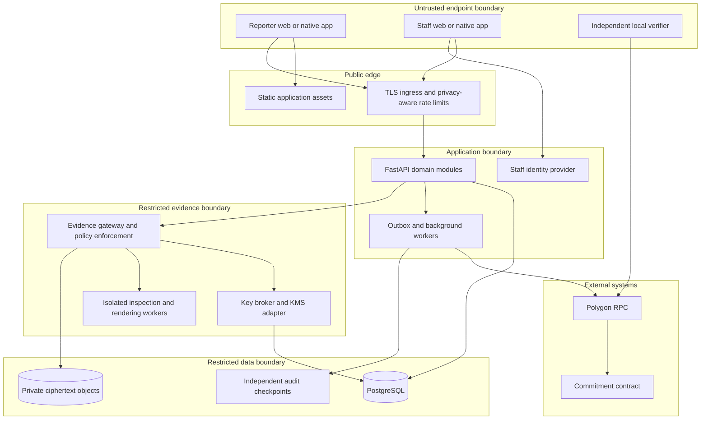
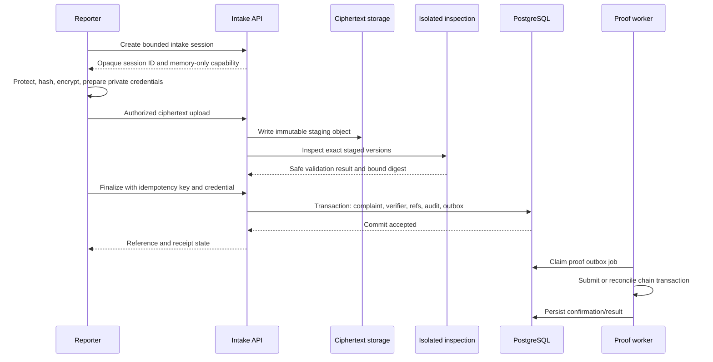

# VeilProof — Technical Architecture Document

**Version:** 1.0 — proposed architecture for engineering and security review  
**Date:** 8 October 2026  
**Product baseline:** [VeilProof PRD v1.0](C:/Users/ARSH/.codex/.chatgpt-projects/g-p-6ac7d025dd78819197e1a0de2c25aeac/VeilProof_PRD_v1.0.md)  
**Status:** Design specification; not an implementation report, security certification, or deployment approval.  
**Audience:** Product, frontend/backend engineers, security engineers, infrastructure operators, privacy reviewers, and technical evaluators.

## 1. Architecture summary

VeilProof combines an account-free reporter application with an authenticated investigation workspace. Reporters prepare evidence locally, upload encrypted versions, receive private tracking credentials and integrity receipts, and retrieve a strictly limited public timeline. Staff review protected derivatives first. Access to an original is exceptional, specific to one immutable file version, independently reviewed, and time limited.

The recommended first backend is a **modular FastAPI application**, with separate worker processes and a separately deployable evidence/key gateway. PostgreSQL is the transactional source of truth; private object storage holds ciphertext; Polygon holds opaque salted commitments. This avoids premature service proliferation while separating the component that can use original-evidence keys from ordinary case management.

The design distinguishes four kinds of security:

- **Confidentiality:** local authenticated encryption, restricted key use, and controlled rendering.
- **Authorization:** server-side role, principal, assignment, file-version, and time checks.
- **Integrity:** immutable evidence versions, authenticated ciphertext, and independently checkable commitments.
- **Source privacy:** minimal identity collection and restricted disclosure; network anonymity remains a separate capability.

Evidence is encrypted before upload, but authorized server-side components may decrypt it for narrowly scoped inspection and viewing. This is **not a server-blind end-to-end encrypted system**. The proposed trust model and its limits must be stated accurately.

## 2. Scope, release profiles, and authority

| Profile | Architecture | Data policy | Claims permitted |
| --- | --- | --- | --- |
| D0: demonstration | One frontend, shared in-memory store, mock adapters, fixture media | Fictional only; refresh/reset restores fixtures | Working demonstration of workflows; security operations explicitly simulated |
| M1: functional MVP | Real API, persistent state, staff auth, supported local crypto, ciphertext storage, testnet proof, policy-enforced evidence gateway | Fictional test evidence only | Tested mechanisms and server authorization within a documented single-operator trust domain |
| P1: controlled pilot | Hardened key custody, isolated processing, MFA, operational coverage, independent review, retention/recovery controls | Real data only after readiness gate | Capabilities actually tested and approved for the operator's threat model |
| Later production | Operator-specific routing, supported media expansion, evaluated private-network route, stronger independent custody | Governed deployment | No automatic anonymity, admissibility, or physical-safety guarantees |

The PRD controls product intent. This document proposes technical resolutions where the PRD leaves choices open. Changes to user-visible behavior require a corresponding PRD decision; architecture cannot silently enlarge the product's promises.

**Important proposed refinement:** trusted automated intake inspection may decrypt newly uploaded originals in an isolated, non-interactive processing boundary. Human original viewing still requires Privacy and Oversight decisions. This distinction resolves encrypted-upload validation but expands the set of trusted components. Security and product owners must approve it before M1 implementation; see ADR-06 and Section 11.

## 3. Architectural invariants

1. No reporter account, identity profile, phone, email, Aadhaar, or wallet is required.
2. A complaint reference is never an authentication credential.
3. Reporter-to-identity-clue mappings remain local to the reporter session.
4. Original bytes and protected derivative bytes are distinct immutable versions with distinct keys.
5. No application client can directly list evidence storage or retrieve original keys.
6. Original viewing requires a live grant bound to principal, case, file version, request revision, purpose, mode, and expiry.
7. The requesting investigator, Privacy reviewer, and Oversight reviewer are different human principals.
8. Chain delays never undo accepted complaints or create duplicate complaints.
9. Reporter-safe updates are a dedicated data projection, not filtered internal notes.
10. Sensitive state changes and their audit/outbox records commit together.
11. No evidence bytes, raw file hash, complaint text, secret, filename, or identity is published on-chain.
12. A UI timer, hidden download button, or route guard is not a security boundary.
13. Encryption keys, auth tokens, tracking secrets, private proof inputs, and report text never enter ordinary logs.
14. Timeouts stop future delivery; they cannot recall content already displayed or externally recorded.

## 4. System context and trust boundaries



| Actor/component | Trusted for | Not sufficient to establish |
| --- | --- | --- |
| Reporter client | Local privacy decisions and cryptographic preparation on an uncompromised device | Honest metadata, safe file contents, or allegation truth |
| Public API | Intake coordination and domain authorization | Independent custody from its operator |
| PostgreSQL | Durable workflow transactions | Protection against a database superuser rewriting history |
| Object storage | Ciphertext durability and object isolation | Plaintext confidentiality without sound key custody |
| Evidence gateway/key broker | Enforcing scoped key use and bounded delivery | Resistance to compromise of its own privileged deployment |
| Isolated processor | Limited inspection/rendering without human-readable export | Zero risk from malicious parsers or infrastructure administrators |
| Public chain | External record of a commitment under its consensus model | File availability, source identity, or factual truth |

A normal browser/mobile connection can expose network metadata to ingress providers. Walletless anchoring removes a reporter wallet requirement, not all correlation. A maliciously replaced web client could also exfiltrate plaintext before encryption; secure build/deployment control is part of the trust model.

## 5. Component design and technology choices

| Component | Proposed implementation | Responsibility |
| --- | --- | --- |
| Reporter/staff UI | React Native, Expo Router, TypeScript, Expo web | Forms, role-specific views, local processing, receipt handling |
| Client state | Zustand for ephemeral UI/draft; typed API adapter | Preserve session/navigation state without persisting reporter secrets |
| API | FastAPI, Pydantic, SQLAlchemy, Alembic | Validated contracts, transactions, authorization, domain commands |
| Database | Supabase PostgreSQL | Cases, versions, requests, grants, audit, transactional outbox |
| Staff identity | Supabase Auth with invite-only enrollment and pilot MFA | Authenticated principal; role authority remains server managed |
| Storage | Supabase private Storage | Encrypted immutable object versions and approved ciphertext backups |
| Evidence gateway | Separate Python service/container | Restricted delivery, per-request authorization, key-use orchestration |
| Crypto broker | Narrow internal API plus pluggable KMS adapter | Wrap/unwrap handling and service-identity policy |
| Background processing | Python workers backed initially by PostgreSQL job/outbox tables | Inspection coordination, proofs, notifications, cleanup |
| Blockchain | Solidity, Hardhat, Polygon Amoy | Append-only versioned opaque commitment registry |
| Relayer | Python Web3.py worker | Gas-funded submission and confirmation tracking |
| Verifier | Small independent TypeScript package/CLI | Reproduce commitment and check chain evidence |
| Deployment | Containers for API/workers/gateway; static web hosting | Reproducible releases and independently scoped runtime identities |

Pin actual runtime/package versions during implementation and record them in lockfiles and an SBOM. Do not use floating `latest` images in deployed environments. Provider choice, region, and version compatibility remain deployment decisions, not implied endorsements.

Current Expo documentation includes hashing and AES APIs; the chosen SDK's exact nonce/AAD/key-wrapping behavior must pass cross-platform tests. Do not copy library examples that persist reporter keys into this product's reporter flow. [Expo Crypto documentation](https://docs.expo.dev/versions/latest/sdk/crypto/)

## 6. Frontend architecture

### 6.1 Application structure

```text
apps/client/
  app/                    Expo Router public, wizard, staff layouts
  features/report/        draft, validation, risk, submission
  features/evidence/      picker, capability checks, protection preview
  features/tracking/      credential entry and safe timeline
  features/staff/         queues, assignment, updates, requests
  features/verify/        local proof verification UI
  components/             shared accessible UI and design tokens
  services/               typed interfaces: MockAdapter or ApiAdapter
  security/               ephemeral session and sensitive-state cleanup
packages/
  contracts/              generated request/response types
  crypto-protocol/         encoding, envelopes, test vectors
  verifier/               independent verification implementation
  demo-fixtures/          fictional content; excluded from production
```

Mock and API adapters implement the same domain-facing interface; they do not pretend identical security. Compile-time/environment flags and a persistent banner identify D0. Production bundles exclude demo credentials, role switchers, and simulated clocks.

### 6.2 State ownership

- Draft narrative, file handles, plaintext previews, “this is me” selections, raw keys, and tracking secret: reporter memory only.
- Server case/approval/proof data: authoritative backend; clients cache only authorized projections.
- Staff web session: opaque HttpOnly cookie through same-origin session handling; do not put a refresh token in localStorage.
- Staff native credential: OS-backed protected storage only where needed for authenticated staff sessions; never reuse this policy for reporter drafts.
- Reporter tracking session: short-lived memory/bounded session cookie, cleared on explicit exit; no silent persistent reporter profile.

Guard wizard prerequisites and preserve Back navigation. Backend checks remain authoritative even if a client changes routes or request bodies. Cancel stale requests when roles/cases change; discard responses whose session generation no longer matches.

### 6.3 Platform and processing adapter

Expose interfaces for random bytes, SHA-256, AES-GCM, key wrapping, byte/file reading, image processing, and save/share. Web uses secure-context APIs; native implementations must demonstrate the same wire format. Missing capability produces an explicit unsupported state, never a fallback to weak randomness or plaintext upload.

Start M1 with JPEG and a conservative memory budget. Heavy file processing runs off the UI thread where supported. Arbitrary MP4/MP3 is not enabled merely because a picker accepts those extensions. A native development build is acceptable if a vetted module cannot run in Expo Go.

## 7. Backend modules and service identities

The FastAPI codebase contains modules for intake, tracking, cases, assignment, privacy release, access requests, grants, proof records, audit, and notification. Each module exposes commands and typed queries; route handlers must not implement ad hoc SQL authorization.

Runtime principals are separate:

| Principal | Allowed | Explicitly absent |
| --- | --- | --- |
| `case_api` | Domain tables/functions, safe projections | Original key unwrap; storage administrator credential |
| `upload_gateway` | Create/write bounded staging objects | Arbitrary read/list; key unwrap |
| `inspection_worker` | Attested staging-job reads and narrowly approved decryption | Human evidence export; arbitrary case query |
| `evidence_gateway` | Scoped ciphertext read; request approved key use | Grant creation/approval |
| `key_broker` | Approved unwrap via KMS adapter; policy read | Role administration; proof signing |
| `proof_worker` | Pending opaque commitments and proof status | Evidence storage; plaintext hashes/salts unless required by explicitly separate verifier job |
| `notification_worker` | Safe staff event summaries | Evidence and reporter secret |
| `migration_admin` | Schema changes during controlled deployment | Normal runtime use |

In M1 these may share one controlled host, but credentials and code paths remain separate. Pilot separates deployments and network policy so compromise of ordinary API credentials does not directly yield keys.

## 8. Authentication and authorization

### 8.1 Staff

Validate identity tokens against a configured issuer/JWKS, allowed audience, signature algorithm, expiration, and subject. Map subject to an active server-side membership; do not trust role names sent by the client. Maintain a `human_principal_id` across memberships so one person with two roles cannot supply two independent approvals.

Invite-only onboarding, staff MFA, and role provisioning are operator-controlled. Privileged decisions require recent authentication; proposed freshness is five minutes. The PRD's proposed 15-minute idle and eight-hour absolute session limits remain configurable and must be tested. Role disablement must invalidate active grants/session authorization, not wait for a cached role JWT to expire.

Web cookie sessions require Secure, HttpOnly, appropriate SameSite, origin validation, and CSRF protection for mutations. Native uses bearer tokens in headers, never query strings. CORS is allowlisted and must not allow credentialed wildcard origins.

### 8.2 Reporter credentials and recovery

Generate a 32-byte random tracking secret locally, encoded as base64url without padding. Send it only to the designated credential-registration/authentication operation over TLS; the API stores a keyed verifier, not plaintext. Proposed verifier: `HMAC-SHA-256(pepper, domain || reference_bytes || secret_bytes)`, where the pepper is versioned and stored outside the database. Constant-time comparison and rate limits apply. Keep old pepper versions until associated credentials are migrated or retired.

**Clarification to PRD wording:** sending a client-computed reusable verifier as login material would make that verifier a bearer secret. The proposed protocol instead sends the raw high-entropy secret transiently over TLS and computes the verifier server-side. It is excluded from request tracing and never recoverable from the database. Approval of this refinement is recorded in ADR-08.

Tracking authentication returns only a narrowly scoped short-lived session. Invalid reference and invalid secret return the same response class/body. Rate limiting must avoid revealing existence. A duplicate finalize response is recovered through a distinct in-memory intake capability and operation ID, or saved reference + tracking secret; an idempotency key alone cannot retrieve credentials.

If every private credential is lost, there is no staff or email bypass in M1. Long-term credential recovery would be a separate product and security design.

### 8.3 Authorization function

All staff actions evaluate:

```text
active principal AND active membership
AND operator boundary matches
AND role permits action
AND case scope / current assignment permits action
AND relevant version and request revision match
AND case and workflow state permit action
AND required independent decisions remain valid
AND grant time / revocation / mode constraints hold
```

UI-disabled actions mirror this function but never replace it. Decisions use current primary-database state. An authorization cache must not exceed the five-second revocation objective; original access defaults to a fresh authoritative check.

## 9. Database and isolation model

Use separate logical schemas: `workflow`, `evidence_meta`, `access_control`, `reporter_public`, and `audit`. Keep sensitive tables outside the exposed public Data API schema. Clients call FastAPI rather than querying private tables directly.

Use restricted runtime database roles without ownership or `BYPASSRLS`. RLS provides defense in depth against tenant/scope mistakes; it does not replace command authorization. Set transaction-local context only from validated server identity, reset it by transaction boundary, and test connection-pool reuse. Security-definer functions must use a fixed search path, narrow privileges, and reviewed ownership.

Supabase documents service/secret-key paths that bypass RLS. They must not be embedded in clients or treated as user-scoped credentials. Private Storage and database authorization need explicit policies, including views. [Supabase RLS](https://supabase.com/docs/guides/database/postgres/row-level-security), [Storage access control](https://supabase.com/docs/guides/storage/security/access-control)

### 9.1 Core relational schema

All IDs are opaque random UUIDs unless a table specifies a safe display reference. Timestamps are UTC `timestamptz`. Tables include `operator_id` where applicable; cross-entity foreign keys must prevent cross-operator association.

| Table | Key columns and constraints |
| --- | --- |
| `operators` | ID, approved configuration, active flag |
| `staff_memberships` | auth subject, human principal, operator, role, active; controlled provisioning |
| `intake_sessions` | ID, capability verifier, expiry, state, bound operation; no reporter profile |
| `complaints` | ID, unique reference, operator, lifecycle, priority, optimistic `revision`, accepted time |
| `complaint_payloads` | complaint ID, encrypted narrative envelope, safe processing metadata; no plaintext title index |
| `tracking_credentials` | complaint ID unique, verifier, pepper version, revoked time |
| `upload_objects` | staging ID/path, expected size/hash of ciphertext, immutable completion state, expiry |
| `evidence_items` | case ID, category, safe display label; current-category limit via active-slot constraint |
| `evidence_versions` | ID, item ID, kind, parent/version number, object ID, ciphertext digest, envelope, restricted hash metadata; immutable after completion |
| `inspection_results` | version/job ID, processor version, safe result, validation time; no extracted plaintext |
| `protected_releases` | derivative ID, reviewer principal, decision/reason, time; exact-version scope |
| `assignments` | case ID, investigator principal, active interval, conflict result; at most one active investigator |
| `access_requests` | ID, case/file original-version IDs, requester, current revision, state |
| `request_revisions` | immutable purpose, reason, mode, duration, urgency, request digest |
| `approval_decisions` | revision ID, reviewer principal/role, outcome, conditions, time; unique reviewer-stage decision |
| `access_grants` | original version, requester, approved revision, duration, unused deadline, started/expires times, state, policy epoch |
| `internal_notes` | case, author, encrypted text, amendment linkage; never public projection |
| `public_updates` | case, safe explicit text, publication revision/time; corrected-through-history |
| `protection_tasks` | case, priority, owner, acknowledgment/action state |
| `proof_records` | opaque commitment, version, chain/contract, transaction/event/block references, state |
| `proof_private_inputs` | encrypted salts/nonces/hashes/package material; no tracking secrets |
| `outbox_events` | event ID, aggregate ID/revision, safe payload, delivery state |
| `job_attempts` | job/worker lease, attempt, next run, result code; no evidence text |
| `audit_events` | per-case sequence, actor/action, opaque scope, safe outcome, previous hash/checkpoint metadata |

### 9.2 Indexes and constraints

- Queue indexes: `(operator_id, priority, accepted_at)` and `(operator_id, lifecycle, updated_at)`.
- Active assignment and active evidence-category slots: partial unique indexes; superseded history retained.
- Requests: `(operator_id, state, created_at)`; grants: `(requester_id, state, expires_at)`.
- Unique `(intake_session_id, idempotency_key)` with stored command digest/result pointer.
- Unique proof logical identity per immutable version/domain; retries create attempts, not new proof identities.
- Foreign keys bind grants to exact original version and request revision; validate same complaint/operator.
- Enum/check constraints prevent negative duration, missing active grant times, and invalid stage combinations.

Cross-row principal independence and request compatibility require a transaction/procedure, not only a simple column check. Grant creation and state transitions acquire consistent row locks. Use optimistic revisions for ordinary edits and pessimistic locks for activation/approval races.

### 9.3 Search versus encryption

Reference/status/category queries operate on deliberately minimized metadata. Do not silently create a plaintext searchable mirror of allegations or titles. M1 supports reference and filter search in SQL; title search is performed over a bounded authorized result set after server decryption. Large-scale full-text search over encrypted narratives is deferred. Its future design must state the leakage introduced by any search index.

## 10. Evidence encryption and key lifecycle

### 10.1 Object envelope v1 — proposed interoperable profile

For the small supported M1 objects use one AES-256-GCM operation per immutable version, with a newly generated 32-byte DEK, 12-byte random nonce, and 16-byte tag. Never reuse a DEK/nonce pair. Upload retries resend the exact existing ciphertext; editing or re-encrypting creates a new key and envelope.

Use fixed canonical AAD bytes:

```text
ASCII("VEILPROOF_OBJECT_V1\0")
|| operator_uuid[16]
|| object_uuid[16]
|| evidence_version_uuid[16]
|| kind_u8
|| plaintext_length_u64_be
```

Kinds are versioned protocol constants: original, derivative, complaint payload, internal note, or proof-private-inputs. No filename, personal name, or narrative enters AAD. Transport envelope includes algorithm/version, key recipient version, base64url nonce, AAD fields, wrapped DEK, ciphertext length/digest, and object identity. Validate lengths and expected IDs before decrypting.

Ciphertext digest detects transport/object corruption without decryption; it is not the plaintext evidence hash and is not a replacement for GCM authentication. Authenticated plaintext is never emitted before the complete tag is validated. For this reason M1 buffers a bounded small object in an isolated worker before rendering, rather than streaming unverified plaintext from a single GCM message.

### 10.2 Browser-to-broker key delivery

Proposed wrapping profile: encrypt the 32-byte DEK with a versioned broker RSA-OAEP public key, SHA-256, 3072-bit modulus, empty OAEP label. Pin the accepted profile and key IDs in a signed/key-controlled configuration. Native and browser clients must pass identical vectors. This is a design choice awaiting KMS/provider compatibility review, not a claim that every Expo adapter supports it.

Only the key broker can request private-key unwrap. The case API and relayer cannot. Wrapped key entries carry immutable object/version bindings; GCM AAD detects substitution. Wrap keys are separate from tracking-verifier peppers, relayer signing keys, audit signing keys, and database credentials.

Browser wrapping uses established APIs rather than custom RSA implementations. [Web Crypto wrapKey](https://developer.mozilla.org/en-US/docs/Web/API/SubtleCrypto/wrapKey). Use authenticated encryption and separate key management as described in [OWASP cryptographic storage guidance](https://cheatsheetseries.owasp.org/cheatsheets/Cryptographic_Storage_Cheat_Sheet.html).

### 10.3 Key use and rotation

- Original and derivative have different DEKs; no shared per-case evidence key.
- Broker returns a DEK only over authenticated internal transport to an approved isolated worker, never to a staff browser.
- In-memory DEKs have short operation lifetimes; disable core dumps and persistent debug captures. Best-effort cleanup is not a guarantee of secure erasure in managed runtimes.
- Separate unwrap policies for staging inspection, released protected review, and active original grants.
- Rotate recipient keys with versioned metadata; rewrap existing DEKs in a privileged audited migration without changing evidence ciphertext or proof hashes.
- Revoking a wrapping-key version without recovery planning can destroy access; compromised-key response must distinguish security containment from ordinary rotation.
- Pilot requires tested key recovery with separate custodians. A backup of ciphertext without recoverable wrapped keys is insufficient.

M1 policy enforcement is still controlled by its operator. Resistance to a fully privileged operator requires separately administered trust domains or a reviewed threshold/key-custody design; it is not achieved by naming a component “vault.”

### 10.4 Large media roadmap

Do not extend the one-message, in-memory envelope to 100 MB video without device/worker benchmarks. A future chunked format must authenticate ordering, total length, per-chunk index, final completion, and immutable manifest; derive unique per-chunk nonces safely and specify truncation/reorder tests. Adopt a reviewed construction/library rather than improvising streaming cryptography. New formats receive new protocol versions and compatibility tests.

## 11. Intake, inspection, and protected-copy processing

### 11.1 Two distinct validation layers

Local validation provides early feedback but is untrusted. The server verifies ciphertext size/completeness and then dispatches an **automated sealed inspection job**. The worker can decrypt exactly the staging versions authorized by that job to verify GCM, plaintext hash, type/signature, decode limits, and supported metadata removal. It never returns original plaintext to a user.

This inspection capability is independent of investigator grants and must not become a human preview bypass. Controls: isolated container, no external network, no interactive shell for routine staff, job-bound object IDs, short lease, resource limits, no writable persistent plaintext volume, safe result schema, and restricted broker service identity. The processor reports minimal result codes and approved counts, not discovered names or raw EXIF values.

If this automated plaintext trust boundary is not approved, the alternative is sealed storage with explicit “unvalidated original” state and narrower functionality. It cannot truthfully claim server-verified original signatures/hashes or malware checks before authorized inspection. ADR-06 must be resolved rather than silently mixing these alternatives.

### 11.2 JPEG MVP

Read bytes locally, compute original hash, preserve original, inspect supported EXIF fields, decode pixels, normalize orientation, and re-encode a separate derivative with an explicit metadata allowlist. Reinspect the derivative independently. Re-encoding changes bytes and may change appearance; require a preview and check resolution/orientation rather than describing it as lossless original preservation.

No claim of complete visible-content anonymization follows from EXIF removal. A face in the image remains visible unless a tested redaction capability is explicitly enabled. Fictional face/voice transformations live only in D0 fixtures until implemented.

### 11.3 Object staging and immutability

Use opaque random object paths with no source filenames. M1 uploads ciphertext through a bounded FastAPI upload gateway using an authorization header, so bearer secrets do not appear in query strings. Do not return provider signed URLs containing tokens as a workaround for the no-secret-URL rule. Larger resumable upload transport is a later performance decision.

Objects move logically from Staging to Complete to Inspected to Attached. Completion locks the object against overwrite; disable upsert and reject stale completion hashes. Actual provider copies, if required, use new opaque paths and verify ciphertext digest. Case finalization checks the immutable inspection snapshot and exact object generation.

Failed inspection quarantines an item and blocks its protected release. The reporter may remove it and finalize the remaining report. No automatic upload to public malware-analysis services is allowed.

## 12. Submission transaction and recovery



### 12.1 Atomic acceptance

Lock intake session and completed upload refs; verify operation digest, ownership, expiry, quotas, inspection, and exact version. In one transaction create the complaint, tracking verifier, evidence bindings, safe receipt metadata, initial public event, Critical task when needed, audit record, and outbox events. Only after commit return Accepted.

The response must not rely on the backend retrieving a plaintext tracking secret; the client already generated it. Repeated requests with the same idempotency key and digest return the same accepted result. A different digest on the same key returns 409. Check intake authorization on every replay.

### 12.2 Partial failure matrix

| Failure point | Behavior |
| --- | --- |
| Selection/protection fails | Preserve draft; no accepted evidence invented |
| Upload interrupted | Resume/retry bounded ciphertext upload; no new complaint |
| Inspection fails | Quarantine; remove/retry supported item; do not release original as fallback |
| DB transaction fails | No Accepted response; retry same command |
| Response lost after commit | Authenticated session recovery returns existing reference/result |
| Browser refresh without saved receipt | Explain lost local draft/session; no email bypass; accepted case remains durable |
| Proof submission fails | Case remains accepted, proof Failed/Pending, retry same commitment |
| Queue duplicate | Consumer deduplicates logical operation |

Proposed staging lifetime is 24 hours; retention is configuration pending operator review. Cleanup only removes expired **unattached** objects after a grace period and rechecks under lock. It cannot race accepted finalization into deleting its evidence. Database backups/restores must reconcile object references rather than assuming matching clocks guarantee consistency.

## 13. Protected release, assignment, and public projection

Protected release references an immutable derivative version and its inspection result. Privacy review may reject, hold, or release. The assigned investigator receives only released versions. Corrected derivatives create new versions, releases, and commitments; no in-place replacement.

Assignment rechecks expertise/jurisdiction configuration, availability, and conflict state within the command transaction. One active investigator per case is the initial rule. Reassignment increments an authorization epoch, revokes grants, and creates audit/outbox events. Old browser state confers no entitlement.

Risk escalation creates a distinct Oversight task. It does not require receipt confirmation or original access. Critical task acknowledgment and protective action are separate state transitions.

Reporter tracking reads only a purpose-built projection: reference, public status, safe updates, coarse protection/proof state, and update time. Staff write public updates through an explicit command with preview; internal notes use a different command/model. A serializer must not derive public output from all ORM attributes. Projection updates occur in the same transaction where practical; otherwise the API reports its watermark and only approved events are replayed.

## 14. Original-access authorization protocol

### 14.1 Immutable request and decisions

Request revision includes original-version ID, requester human principal, purpose, insufficiency reason, duration, mode, urgency, and case revision binding. Compute a canonical request digest. Privacy recommendation and Oversight decision reference that revision/digest. Both reviewers differ from requester and each other.

If purpose, file, or broader scope changes, create a new revision and require new reviews. Oversight may narrow a Privacy-approved duration/mode only when the approved set of capabilities contains the narrowed set. Rejection or clarification yields no grant.

### 14.2 Activation algorithm

Proposed policy: unused approval expires after 24 hours; timer starts on first authorized Open. In a transaction:

```text
lock grant and relevant case/assignment authorization row
validate current principal, role, assignment, exact request decisions, mode
if revoked/ended/closed/unused-deadline-passed: deny
if approved_unused:
    started_at = authoritative database time
    expires_at = started_at + approved_duration
    state = active
    append activation audit and outbox event
else if active and database time >= expires_at: deny and record expiry once
commit
issue session-bound viewer handle without DEK or storage URL
```

Concurrent opens serialize and share one start time. Use a consistent lock order: complaint/authorization epoch → grant → audit counter. Renewing the viewer session never renews the grant. New access requires a new reviewed request after expiry.

### 14.3 Evidence gateway enforcement

Viewer handle is an opaque capability sent in a header or secure session mechanism, bound server-side to staff session, grant, and version. Each request checks authoritative state. The broker independently validates the service identity and policy context before unwrap; it must not accept a client-provided `approved=true` flag.

Only the renderer receives the key. It authenticates the full ciphertext before exposing pages or stream segments. The browser receives rendered pages or a bounded media stream, not the original encrypted blob plus reusable key. Original PDF rendering and audio segmentation are format-specific features, not generic browser embeds.

For the small JPEG M1, the worker can render a page after bounded full authentication. Any complete image already delivered can be retained by its viewer; expiry blocks new delivery, not possession of those pixels. Audio/video support requires bounded prefetch, range restrictions, and segment checks before enablement.

Revocation transaction changes grant state/epoch and durably records audit. Gateway checks at each delivery boundary and at intervals no longer than five seconds during active delivery; if checking fails, stop. Client receives an event or discovers denial on heartbeat and closes the viewer. Server enforcement does not depend on client clock, tab visibility, or notification delivery.

### 14.4 Emergency and forensic access

There is no hidden “break glass” original-view route in M1. Urgent protective action uses available protected evidence and the Oversight task. An emergency original-access policy would require a separate audited governance decision.

Forensic analysis mode is disabled until an isolated analysis environment, approved tools, output controls, and export policy exist. The fictional audio example demonstrates approval, not validated forensic conclusions.

## 15. Blockchain commitment protocol

### 15.1 Canonical commitment v1 proposal

Use fixed-width binary encoding rather than concatenating JSON strings. The protocol input is exactly:

```text
domain[32]           = SHA256(ASCII("VEILPROOF_COMMITMENT_V1"))
kind[1]              = 0x01 file-pair | 0x02 reference | 0x03 submission
salt[32]             = CSPRNG bytes, private
case_nonce[32]       = CSPRNG bytes, private
version_nonce[32]    = CSPRNG bytes, private and unique per committed revision
original_hash[32]    = SHA256(exact original bytes or canonical record bytes)
protected_hash[32]   = SHA256(exact protected bytes or canonical record bytes)
commitment[32]       = SHA256(domain || kind || salt || case_nonce ||
                            version_nonce || original_hash || protected_hash)
```

The preimage is 193 bytes. UUIDs, reference, names, dates, chain IDs, and URLs are not implicitly appended. For a canonical reference/submission record with no derivative, both hash slots contain the same record hash; never invent a file. Each kind has a separately specified canonical record schema using RFC 8785 JSON canonicalization, fixed field types, and UTF-8. File-pair encoding is ready for test-vector implementation; record schemas must be frozen before enabling those proof kinds.

The case nonce is private and not a public case identifier. Version nonce binds corrected derivatives into a new commitment. This is an architectural extension of the PRD's conceptual formula and requires protocol review before release. The chain does not calculate the preimage or validate its truth; it stores the opaque result.

### 15.2 Contract boundary

Proposed minimal interface:

```solidity
function anchor(bytes32 commitment, uint16 proofVersion) external;
event Anchored(bytes32 indexed commitment, uint16 proofVersion);
```

Only an authorized relayer may submit to the application's canonical deployment. Store first-seen block metadata or a boolean mapping to prevent ambiguous duplicate anchoring; the function's duplicate behavior must be idempotent or predictably revert and be reconciled by the worker. No update/delete of committed entries. Limit pause/admin powers to future submissions; they cannot erase events already emitted.

Prefer a small non-upgradeable versioned deployment for M1. New protocol/contract versions deploy separately and are allowlisted by the verifier. A governance key can change approved submitters under a reviewed procedure; key rotation cannot reinterpret historical commitments. Do not put the case reference, evidence category, raw hashes, or source filename in events.

Amoy chain ID and current connection details must come from checked configuration; initial intended chain ID is 80002. Contract address is unknown until deployment and must never be invented in receipts. [Polygon RPC documentation](https://docs.polygon.technology/pos/reference/rpc-endpoints)

### 15.3 Relayer reliability

Proof worker receives opaque commitment, protocol version, and internal record ID only. Serialize transactions per signer or use a database-backed nonce allocator. Persist signer nonce, signed transaction identity, replacement lineage, and result before interpreting broadcast success. On uncertain broadcast, query existing hash/nonce/event before constructing another logical operation.

States: Queued → Broadcast → Confirmed; retryable Failed; Reconfirmation required on reorganization. Store block hash and event index and recheck against the canonical chain. Finality/confirmation policy is deployment configuration with a recorded justification, not a hardcoded claim that one block is sufficient.

Rate-limit/budget submission, monitor signer balance, and keep the signing key out of API containers. A relayer compromise can publish unwanted commitments but must not decrypt evidence. RPC providers can observe requested commitments and timing; offer offline/local-package verification separately from external anchor checking.

## 16. Receipts and independent verification

### 16.1 Separate artifacts

**Tracking receipt:** receipt format version, safe reference, tracking secret, accepted timestamp, evidence count, and instructions. Generated locally from the accepted response and already-held secret; explicitly private.

**Proof package:** protocol version, kind, salt, nonces, expected original/protected hashes, commitment, chain ID, contract address, transaction hash, block hash/number, event index, and scope label. No tracking secret, actual source filename, or report narrative. Proposed package schema is validated against strict size/type rules, rejects duplicate/unknown critical fields, and treats all incoming data as untrusted.

Stored proof-private inputs are encrypted under a separate proof-material policy. API retrieval through an accepted intake/reporter session may allow completing an initially Pending package; staff case views do not expose these inputs. Updates after confirmation reuse the same proof identity.

### 16.2 Verification steps

1. Validate schema/version and require an independently trusted network/contract configuration.
2. Hash supplied candidate file bytes locally; compare the corresponding expected hash.
3. Recompute the 193-byte commitment from package fields.
4. Fetch transaction receipt/event from the configured network; verify success, contract, exact commitment/version, event position, block identity, and confirmation policy.
5. Report scope precisely. Supplying only the original checks original bytes; it does not independently inspect the companion derivative.
6. If offline, report local package consistency only. No anchor check means no blockchain-verification claim.

Do not accept an arbitrary package-supplied RPC URL: it could track the reporter, cause network abuse, or fabricate a chain response. Candidate bytes, salts, and tracking credentials never go to RPC. An independently distributed verifier/configuration is necessary if verification must remain meaningful when the main service is unavailable or compromised.

A proof can demonstrate a commitment existed by the recorded block time; it does not continuously prove storage availability or eliminate the need for the candidate evidence. Receipts are sensitive even without tracking credentials because they reveal confirmation material for known files.

## 17. API surface and error contracts

Prefix routes with `/api/v1`. All examples describe proposed contracts, not implemented endpoints. APIs use strict input models and output allowlists. Sensitive credentials live in authorization headers or protected bodies, never URLs.

| Method/path | Principal | Purpose |
| --- | --- | --- |
| `POST /intakes` | Account-free, quota limited | Create ephemeral intake capability |
| `POST /intakes/{id}/objects` | Intake capability | Reserve bounded immutable object |
| `PUT /intakes/{id}/objects/{objectId}/content` | Intake capability | Stream ciphertext with declared digest/length |
| `POST /intakes/{id}/objects/{objectId}/complete` | Intake capability | Lock completion and schedule inspection |
| `GET /intakes/{id}/state` | Intake capability | Recover own staging/acceptance result |
| `POST /intakes/{id}/finalize` | Intake capability | Idempotent accepted complaint |
| `POST /tracking/sessions` | Reference + secret | Issue restricted tracking session |
| `GET /tracking/status` | Tracking session | Safe projection only |
| `POST /tracking/proof-package` | Tracking session | Obtain private proof package for own case |
| `GET /staff/cases` | Staff | Authorized filtered cases, cursor pagination |
| `POST /staff/cases/{id}/releases` | Privacy | Release reviewed derivative version |
| `POST /staff/cases/{id}/assignments` | Privacy | Eligibility-checked assignment |
| `POST /staff/cases/{id}/public-updates` | Assigned staff | Explicit safe publication |
| `POST /staff/cases/{id}/internal-notes` | Assigned staff | Restricted note |
| `POST /staff/cases/{id}/access-requests` | Investigator | New immutable scoped request |
| `POST /staff/access-requests/{id}/privacy-decisions` | Privacy | Recommend/reject/clarify |
| `POST /staff/access-requests/{id}/oversight-decisions` | Oversight | Final scoped decision |
| `POST /staff/grants/{id}/activate` | Bound investigator | Atomic activation and viewer session |
| `POST /staff/grants/{id}/end` | Requester | End own access |
| `POST /staff/grants/{id}/revoke` | Privacy/Oversight | Immediate server revocation |
| `POST /staff/viewer/content` | Bound viewer session | Restricted content delivery, no storage URL |
| `POST /staff/cases/{id}/closure-decisions` | Oversight | Close/return/reopen with reason |
| `GET /staff/cases/{id}/audit` | Scoped staff | Role-appropriate safe audit |

Use `Idempotency-Key` for retryable mutation commands and expected revision/`If-Match` for stale edit detection. Proposed error shape: `code`, `safe_message`, `request_id`, `retryable`, and optional non-sensitive `field_errors`. Never return parser dumps, SQL errors, object paths, or stack traces.

Use 401 for missing/expired credentials, 403 for denied authorized context, 404 where resource existence must be hidden, 409 for state/idempotency conflicts, 413 for size, 422 for validation, 429 with bounded retry guidance, and 503 for unavailable authoritative dependencies. Tracking failure semantics remain uniform. Staff may receive more actionable state guidance only within their permitted case scope.

## 18. Jobs, outbox, and synchronization

Use a PostgreSQL transactional outbox rather than an in-process task for durable work. Commit domain change, audit row, and event in one transaction. Workers claim jobs with leases; retries use exponential backoff with jitter, maximum attempts, and a dead-letter state with safe error codes. Handlers must tolerate at-least-once delivery.

`FOR UPDATE SKIP LOCKED` is suitable for queue consumers, not general authoritative case reads. Use lease expiration and heartbeats for crashed workers; the business action still needs an idempotency constraint. [PostgreSQL SELECT/locking documentation](https://www.postgresql.org/docs/current/sql-select.html)

Events include `ComplaintAccepted`, `ProtectedVersionReleased`, `InvestigatorAssigned`, `OriginalRequested`, `PrivacyRecommended`, `OriginalApproved`, `GrantActivated`, `GrantRevoked`, `PublicUpdatePublished`, `ProofConfirmed`, and `CaseClosed`. Payloads contain opaque IDs/revisions and safe routing data, not evidence/plaintext.

M1 can use authenticated polling at up to five-second intervals for queues and notifications. SSE/WebSocket is optional and must use an authenticated session without URL tokens. Push events are hints to refetch, never authority to open evidence. Global raw database subscriptions are prohibited. Poll/stream reconnection must revalidate membership and not reveal cross-case events.

Expiry enforcement is synchronous in the gateway; a sweep worker only records/cleans expired grant state. A delayed sweep cannot extend access.

## 19. Audit architecture

Each sensitive command appends a safe event in its state-change transaction. Include operator/case scope, per-case sequence, actor principal and role, event type, opaque evidence/request revision IDs, time, result, and non-sensitive reason code. Detailed justifications remain separately encrypted records referenced by ID.

For pilot tamper detection, hash each canonical event with its predecessor under a per-case sequence lock; periodically sign and export checkpoints to separately controlled immutable retention storage. Verify gaps, forks, and checkpoint continuity. A hash chain kept only in the same administrator-writable database does not prevent that administrator rewriting the whole chain.

Audit export must obey the same privacy allowlists and operator boundaries. Original content, removed names, tracking secrets, keys, proof salts, and decrypted narratives are excluded. Evidence-open events are recorded before content delivery; if audit durability is unavailable, deny the original operation.

Operational logs and access audit are different products with different readers and retention policies. Do not use a general log aggregator as the sole chain-of-custody record.

## 20. Deployment topology and network policy

### 20.1 Initial deployment

- Static frontend served over TLS with strict security headers and no reporter analytics.
- Same-origin web API reverse proxy where practical to simplify cookie/CSRF boundaries.
- API containers with managed Postgres connections and bounded pools.
- Separate worker process for proof/notifications; separate restricted evidence gateway/processor.
- Private ciphertext buckets; no public bucket fallback.
- KMS/secret provider reachable only by assigned workloads.
- Testnet RPC egress only from relayer/verifier paths, not processing sandboxes.

M1 provider/region remains open. Before real-data pilot, approve actual data locations for database, object replicas/backups, key service, logs, and third-party infrastructure. Selecting an India region for one component does not establish that every copy or control plane is India-only.

### 20.2 Network allowlist

| Workload | Allowed egress |
| --- | --- |
| Public API | Database, designated auth/JWKS, internal gateway/job services |
| Upload gateway | Private storage only plus metadata transaction service |
| Key broker | KMS and authoritative policy store |
| Inspection/render worker | Broker and exact object capability via internal gateway; no general internet |
| Relayer | Approved RPC and signer service |
| Notification worker | Internal staff event system only in M1 |

Use authenticated internal transport and workload identities; network location alone is not authorization. Do not expose Postgres, broker, or processors publicly. Restrict metadata-service access from untrusted processing containers.

### 20.3 Browser hardening

Use CSP with minimal sources, clickjacking protections, MIME sniffing protection, `Referrer-Policy: no-referrer`, and `Cache-Control: no-store` on sensitive responses. Disable service-worker caching of reporter/staff private data. No third-party fonts/scripts that receive reporting-page requests. Self-host approved assets and avoid external link previews.

These controls reduce ordinary browser exposure but cannot protect a compromised endpoint or prevent authorized screenshots.

## 21. Capacity, reliability, and degradation

The PRD proposes 100 concurrent staff sessions, 20 concurrent finalizations, routine API p95 below one second, five-second state visibility/revocation, and a pilot availability target of 99.5%. Treat these as benchmark targets; media processing and chain latency are separate distributions.

Size worker concurrency from maximum supported plaintext size, decode expansion, and rendering overhead—not compressed upload size alone. Apply per-job CPU, RAM, pixel count, duration, and output limits. For example, a small compressed image can decode to excessive memory. Saturated inspection queues return Processing/Retry guidance rather than accepting unlimited jobs.

| Dependency unavailable | Expected degradation |
| --- | --- |
| PostgreSQL primary | No new original access/approvals/finalization; clear retry state |
| Key broker/KMS | No new decrypt/render; ciphertext remains preserved |
| Object store | Upload/view unavailable; case state retained |
| RPC/chain | Cases accepted; proof queued/pending; investigations continue |
| Notification worker | State changes committed; staff polling still discovers them |
| Audit checkpoint export | Queue and alert; do not claim checkpoint complete; local durable audit required |
| Trusted server time unhealthy | Deny grant activation/delivery until corrected |

Do not use stale authorization replicas to decide original access. Case list reads may use approved caching; grant decisions use authoritative current state. Recovery after outage never resurrects a revoked/expired grant automatically.

## 22. Backup, retention, deletion, and recovery

Back up PostgreSQL, immutable ciphertext objects, envelope metadata, wrapped keys, and external audit checkpoints with a tested consistent recovery procedure. The PRD's proposed RPO ≤24 hours/RTO ≤8 hours needs operator approval for evidence custody; it is not a guarantee that accepted evidence survives every disaster.

Run restore exercises that verify object digests, decrypt test originals, reconstruct proof bindings, and confirm access policies remain deny-by-default. Restored grants are treated as inactive until revalidated; past expiry is never extended by backup time. Recover tracking verifiers with pepper versions under separate custody.

Retention is policy-driven by operator, evidence class, case state, and legal hold. Deletion commands require authorization, hold checks, an audit/tombstone, and a documented backup-expiry schedule. Garbage collection and user-requested deletion are different operations. Do not promise immediate erasure from every backup.

Public blockchain commitments cannot be erased by deleting a database row. Assess permanent-public-data implications before production anchoring, even though the commitment is opaque. Destroying all keys may render ciphertext unreadable, but “cryptographic erasure” requires accounting for caches, exports, wraps, and backups.

## 23. Observability and incident response

Collect structured safe metrics: API latency/error classes, queue age, accepted-count aggregates, proof confirmation lag, storage failures, worker resource exhaustion, audit gaps, active grant count, and revocation-check failures. Never label metrics with reporter secret, evidence filename, narrative, salt, or arbitrary user text. Avoid case-level identifiers in broad analytics dashboards.

Ingress, CDN, provider, and database logs can retain metadata even when application logs do not. Document each logging layer, restrict access, and apply the operator's reviewed retention policy. No blanket “zero logs” claim.

Runbooks must cover: suspicious access, leaked staff credential, relayer compromise, KMS outage, broker compromise, corrupt ciphertext, missing object, database restore, chain reorganization, malformed-file campaign, and Critical queue overload.

Containment controls include disabling principal memberships, revoking grants and viewer sessions, stopping new original delivery, quarantining processor jobs, and pausing future chain submissions independently. Alert channels contain safe IDs and reason codes, not evidence or identifying allegations. A broker compromise requires assessment of what plaintext/keys could have been exposed; revocation cannot undo that exposure.

## 24. Testing and technical release gates

### 24.1 Protocol and unit testing

- Fixed cross-language SHA-256/AES-GCM/wrapping/commitment vectors; include non-ASCII data and zero-length payload behavior where allowed.
- Wrong nonce, AAD, key, tag, version, kind, and truncated ciphertext must fail without plaintext release.
- Request canonicalization, scope narrowing, and version binding are deterministic.
- Mapping of internal to public states cannot expose internal detail.
- Safe error serialization excludes exception internals.

### 24.2 Integration and concurrency

- Duplicate finalize requests with same/different digests; response loss after commit.
- Double role use by one principal, stale membership, conflicted assignment, and direct API calls bypassing UI.
- Concurrent final approvals and first opens; one grant timer only.
- Revoke while rendering/streaming; backgrounded client; gateway network loss; stale session.
- File A grant used for file B/version B; changed request after approval.
- Pool connection context leakage between operators and users; view/function RLS bypass tests.
- Worker crash after chain broadcast before DB update; nonce replacement; duplicate/reordered events.
- Cleanup racing finalization; failed inspection cannot become released.

### 24.3 Security and privacy verification

Inspect network traffic, provider logging configuration, storage ACLs, backups, browser caches, clipboard actions, and staff/reporter response contracts. Prove no original DEK reaches a staff client. Verify no “this is me” mapping enters remote storage. Exercise hostile file corpora in isolated test infrastructure and review parser/resource limits.

Independent verification tests must run without the case API and must reject a fabricated package pointing to an untrusted contract/RPC. Confirm altered candidate bytes fail and that offline status never claims an anchor check.

### 24.4 Gates

| Gate | Required evidence |
| --- | --- |
| D0 complete | Connected fixture walkthrough, correct states, clear simulations, accessibility checks |
| M1 complete | Backend denial tests, actual ciphertext/crypto vectors, durable recovery, deployed testnet details, independent verifier, no claimed live unsupported media |
| Pilot approved | Operator and legal review, resolved inspection/key model, independent security assessment, closed critical findings, restore drill, staffed protection runbook |
| Expanded media | Format-specific security corpus, local/device benchmarks, rendering and revocation tests, truthful transformation guarantees |

Trace tests to PRD AT-01 through AT-27. Architecture-specific tests supplement those acceptance checks; no passed results are asserted here.

## 25. CI/CD and repository plan

```text
veilproof/
  apps/client/
  services/api/
  services/evidence-gateway/
  services/key-broker/
  workers/inspection/
  workers/proof/
  workers/notifications/
  packages/contracts/
  packages/crypto-protocol/
  packages/verifier/
  contracts/solidity/
  database/migrations/
  infrastructure/
  tests/protocol/ integration/ authorization/ adversarial/
  docs/architecture/ runbooks/ decisions/
```

Pipeline: formatting/type checks → unit/protocol vectors → migration/schema tests → API/RLS and grant tests → smart-contract tests/static analysis → dependency/secret/container scanning → ephemeral staging deploy → end-to-end negative tests → controlled release.

Use expansion/contraction migrations and compatibility checks for rolling updates. Protocol versions and contract allowlists are versioned separately from UI releases. Never reinterpret old commitments after a serializer change. Sign/tag release artifacts where supported and record lockfiles, migration version, build provenance, and protocol vectors.

Demo fixtures must not leak into production through a runtime toggle. Restore/seed scripts refuse production identifiers. Infrastructure secrets arrive through workload/secret management, not repository files or build logs. Production deployment, schema privilege changes, and key policy changes require accountable review.

## 26. Architecture decision records

| ADR | Proposed decision | Reason / tradeoff | Status |
| --- | --- | --- | --- |
| ADR-01 | Modular API plus separate evidence/key boundary | Manageable MVP with separation where plaintext/key authority matters | Proposed |
| ADR-02 | FastAPI is the client data boundary | Centralizes invariant enforcement; RLS remains defense in depth | Proposed |
| ADR-03 | Per-version AES-GCM keys and broker wrapping | Prevents one file grant unlocking a case; adds key lifecycle work | Security review required |
| ADR-04 | No original DEKs in investigator clients | Allows enforcement of future delivery limits; server is trusted for rendering | Proposed |
| ADR-05 | Start timer on first Open, unused approval 24 hours | Predictable UX and atomic activation | Product approval required |
| ADR-06 | Automated isolated intake inspection can decrypt staging originals | Validates encrypted uploads without routine human access; expands trusted computing base | Explicit product/security decision required |
| ADR-07 | Fixed-width commitment with version nonce | Unambiguous cross-language proof and derivative revisions | Protocol review required |
| ADR-08 | Server-keyed verifier of transiently received tracking secret | Avoids pass-the-verifier ambiguity; credential is briefly visible to auth API | PRD refinement required |
| ADR-09 | PostgreSQL outbox before external queue broker | Durable transactional jobs without another dependency | Proposed |
| ADR-10 | Minimal versioned non-upgradeable proof contract | Simple historical interpretation; new versions need deployments | Proposed |
| ADR-11 | JPEG-first real pipeline | Feasible tested scope; multimedia remains clearly separated | Matches PRD |
| ADR-12 | Bounded decrypted authorized title search in M1 | Avoids unacknowledged plaintext index; limited large-scale search | Product/engineering review |
| ADR-13 | Header-authenticated upload proxy | Keeps capability secrets out of URLs; adds bandwidth/capacity cost | Proposed |
| ADR-14 | Separate tracking receipt and proof package | Sharing proof cannot grant tracking access | Matches PRD |

## 27. Unresolved decisions and implementation sequence

Resolve before building real cryptographic paths: key provider/wrapping compatibility; native crypto support; canonical record schemas; inspection trust boundary; staff principal provisioning; backend region/network policy. Resolve before pilot: actual operator/jurisdiction, retention and disclosure, network-privacy claims, protection staffing, independent security review, and emergency procedures.

Implementation sequence:

1. Freeze interfaces, state machines, principal model, and D0 fixtures.
2. Implement durable case commands, safe reporter projection, and backend authorization tests.
3. Implement protocol packages and cross-runtime vectors before storing any evidence.
4. Add immutable upload, inspected derivative workflow, and restricted key broker/gateway.
5. Implement independent request decisions, atomic grants, and revocation tests.
6. Deploy testnet commitment contract and reliable relayer; deliver independent verifier.
7. Integrate UI through API adapters, recovery states, accessibility, and role walkthroughs.
8. Validate the entire M1 with fictional data; resolve pilot-only operational/security gates separately.

No delivery duration is inferred from the earlier hackathon pitch. The architecture is intentionally more detailed than a 24-hour demonstration.

## 28. References and source use

Project baseline: [PRD v1.0](C:/Users/ARSH/.codex/.chatgpt-projects/g-p-6ac7d025dd78819197e1a0de2c25aeac/VeilProof_PRD_v1.0.md) and [reconstructed project context](C:/Users/ARSH/.codex/.chatgpt-projects/g-p-6ac7d025dd78819197e1a0de2c25aeac/VEILPROOF_PROJECT_CONTEXT.md). These consolidate the supplied research, deck, and Figma prompts.

Official technical documentation checked for this draft on 8 October 2026:

- [Expo Crypto](https://docs.expo.dev/versions/latest/sdk/crypto/) — platform crypto capability reference; not proof that VeilProof's exact envelope/wrap profile works on every target.
- [Supabase private Storage access control](https://supabase.com/docs/guides/storage/security/access-control) and [PostgreSQL RLS guidance](https://supabase.com/docs/guides/database/postgres/row-level-security) — policy boundaries and privileged bypass considerations.
- [Web Crypto wrapKey](https://developer.mozilla.org/en-US/docs/Web/API/SubtleCrypto/wrapKey) — standard key-wrapping API behavior.
- [OWASP cryptographic storage](https://cheatsheetseries.owasp.org/cheatsheets/Cryptographic_Storage_Cheat_Sheet.html) — authenticated encryption, threat-model-driven design, key management.
- [PostgreSQL SELECT](https://www.postgresql.org/docs/current/sql-select.html) — row locking and queue-oriented skip-locked behavior.
- [Polygon RPC endpoints](https://docs.polygon.technology/pos/reference/rpc-endpoints) — intended testnet connection configuration.

Provider APIs and libraries evolve. Engineering must pin and test selected versions. The object envelope, commitment encoding, schema, topology, and control proposals in this document are VeilProof-specific design choices rather than claims that a provider supplies them automatically.
