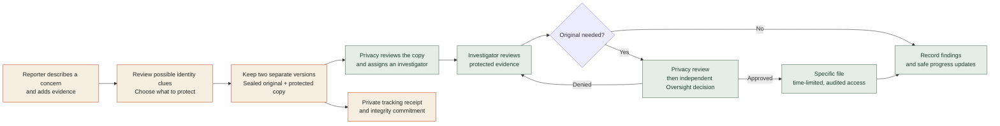

<p align="center">
  
</p>

<p align="center">
  <strong>An India-focused whistleblower reporting and evidence workflow.</strong><br />
  Help evidence reach an accountable investigation while reducing unnecessary exposure of its source.
</p>

<p align="center">
  <a href="#watch-and-explore">Watch &amp; explore</a> ·
  <a href="#how-veilproof-works">How it works</a> ·
  <a href="#product-screenshots">Screenshots</a> ·
  <a href="#technical-direction">Technical direction</a>
</p>

> [!IMPORTANT]
> The available materials describe a prototype and a proposed architecture. Screenshots and demonstrations should use fictional evidence. Do not use this README or a UI preview as proof that evidence protection, anonymity, access control, or blockchain verification has been implemented and security-tested.

## Watch and explore

The three deployment links are reserved for the actual application. Replace each token when its URL is ready.

| Experience | Link to add | What it shows |
| --- | --- | --- |
| **Demo video** | `VIDEO_URL_HERE` | A short walkthrough of the reporter and investigation journeys |
| **Frontend on Vercel** | `VERCEL_URL_HERE` | The VeilProof application |
| **Backend on Render** | `RENDER_URL_HERE` | The API base URL or a safe health endpoint |
| **Interactive story pitch** | [Explore the VeilProof story](https://veilproof-evidence-story.woodsywood5.chatgpt.site/) | A separate, illustrative five-minute presentation |

> The story pitch illustrates the concept. It does not submit a real report or grant access to real evidence.

## Why VeilProof?

A whistleblower may have records that matter to the public, yet those same records can reveal who found them. A document author field, a face in a photograph, a voice in a recording, or a file’s location history can expose a source before an investigation even begins.

VeilProof brings the reporter’s protection choices, the investigation workflow, and evidence integrity into one coherent journey. It is designed around three principles:

| Protect the person | Preserve the evidence | Account for access |
| :--- | :--- | :--- |
| The reporter reviews possible identity clues and chooses what to protect. | An unchanged original is kept separately from a protected investigator copy. | Routine review uses the protected copy; an original requires a specific, independently reviewed, time-limited request. |

## How VeilProof works



**The reporter journey:** Start without a required identity account, describe the concern, review evidence, confirm protection choices, receive a case reference and separate tracking secret, and return for limited status updates.

**The staff journey:** A Privacy & Evidence Officer reviews protected material and assigns an investigator. The investigator works from the released copy. Access to an original is exceptional: a distinct Privacy reviewer makes the first decision, then a distinct Oversight reviewer makes the final decision. The first decision alone never opens the original.

**The integrity receipt:** The proposed design anchors only an opaque commitment to a blockchain. Actual evidence, the complaint narrative, identity clues, tracking credentials, and keys stay off-chain. A commitment can help detect later changes; it cannot establish whether an allegation is true.

## Product screenshots

Each panel below is **a labelled screenshot slot**, not an application capture. Replace the matching image reference with a real screenshot after verifying that the screen works. Keep all example cases fictional and remove secrets before capture.

| 01 · Reporter intake | 02 · Identity review |
| --- | --- |
| <br />`docs/screenshots/01-reporter-intake.png` | <br />`docs/screenshots/02-identity-review.png` |
| **03 · Protected copy and sealed original** | **04 · Privacy review and assignment** |
| <br />`docs/screenshots/03-evidence-versions.png` | <br />`docs/screenshots/04-privacy-workspace.png` |
| **05 · Original-access decision** | **06 · Receipt and private tracking** |
| <br />`docs/screenshots/05-original-access.png` | <br />`docs/screenshots/06-receipt-tracking.png` |

To add screenshots: place your six images at the paths shown, then replace each `assets/readme/screenshot-slot.svg` reference in the relevant table cell with its screenshot path. The alt text is already written for each screen.

## Technical direction

The project documents propose the following stack. Treat this as an architecture target until the application repository and deployments are checked.

| Layer | Proposed technology | Responsibility |
| --- | --- | --- |
| Reporter and staff application | React Native, Expo web, TypeScript | Guided reporting, identity review, role-specific workspaces |
| Application API | FastAPI | Intake, authorization, case workflow, tracking, audit |
| Case records | PostgreSQL, with Supabase considered | Durable workflow state and restricted views |
| Evidence storage | Private object storage | Separately encrypted originals and protected copies |
| Processing and key access | Isolated workers and a separate key-use boundary | Format-specific protection, verification, controlled decryption |
| Integrity proof | Solidity, Hardhat, Polygon Amoy, relayer | Opaque commitments and verifiable receipts; no reporter wallet required |
| Hosting | Vercel frontend, Render backend | Deployment targets; URLs to be added above |

File metadata removal and visible-content protection require different processing for PDFs, images, audio, and video. An unsupported format must never be presented as fully protected.

## Development setup

The imported application source is not included in this documentation workspace, so installation commands cannot be verified here. Once this README is placed in the application repository, fill in its actual paths and commands before telling contributors to run them:

```text
Frontend directory:  <FRONTEND_DIRECTORY>
Install command:     <VERIFIED_FRONTEND_INSTALL_COMMAND>
Start command:       <VERIFIED_FRONTEND_START_COMMAND>

Backend directory:   <BACKEND_DIRECTORY>
Install command:     <VERIFIED_BACKEND_INSTALL_COMMAND>
Start command:       <VERIFIED_BACKEND_START_COMMAND>
```

Keep the backend’s service credentials, encryption keys, signing keys, and tracking-secret verifier out of frontend bundles and repository history. Add an `.env.example` containing **names only** when the actual configuration is finalized.

## Project documents

- [Product requirements](VeilProof_PRD_v1.0.md) — user journeys, feature scope, and acceptance criteria.
- [Technical architecture](VeilProof_Technical_Architecture_v1.0.md) — proposed services, storage, processing, and proof design.
- [Security and access](VeilProof_Security_and_Access_v1.0.md) — roles, key boundaries, original access, and audit requirements.
- [Development plan and Antigravity prompts](VeilProof_Hackathon_Development_and_Antigravity_Prompts.md) — phased hackathon implementation guide.
- [Detailed process flow](VeilProof_Process_Flow.md) — reporter, staff, access, and proof paths.

## Team

**Jee Jee Brats** · VeilProof

This project is being developed as a hackathon concept. The current documentation and illustrative pitch do not establish production readiness or authorization to accept real whistleblower evidence.
